# Product Requirements Document (PRD)

# 1. INTRODUCTION

## 1.1 Purpose

This Software Requirements Specification (SRS) document provides a comprehensive description of the B2B sales intelligence and engagement platform. It details the functional and non-functional requirements for developers, project managers, QA teams, and stakeholders involved in the platform's development and deployment.

## 1.2 Scope

The platform is a comprehensive sales intelligence solution that encompasses:

- Lead database with AI-powered search and enrichment capabilities
- Email automation and sequencing system
- CRM integration framework
- Analytics and performance tracking dashboard

### Core Functionalities

1. **Lead Management**
   - Advanced search with multi-parameter filtering
   - Contact data enrichment
   - AI-driven lead scoring
   - Export and import capabilities

2. **Email Automation**
   - Template management
   - Automated sequence creation
   - A/B testing functionality
   - Performance tracking

3. **Integration Framework**
   - CRM synchronization
   - Email service provider connections
   - API access for third-party tools

4. **Analytics Suite**
   - Campaign performance metrics
   - Engagement tracking
   - ROI calculations
   - Predictive analytics

### Business Benefits

- Reduced prospecting time through AI-powered lead recommendations
- Increased conversion rates via intelligent lead scoring
- Improved email engagement through automated optimization
- Enhanced sales productivity with workflow automation
- Data-driven decision making through comprehensive analytics

# 2. PRODUCT DESCRIPTION

## 2.1 Product Perspective
The B2B sales intelligence platform operates as a standalone SaaS solution while integrating with existing business systems through:

- Direct CRM integrations (Salesforce, HubSpot)
- Email service provider connections
- REST API endpoints for third-party tool integration
- Single Sign-On (SSO) capabilities via Google and LinkedIn

The system architecture follows a modern serverless approach using Next.js and Supabase, allowing for scalable deployment on Vercel's infrastructure.

## 2.2 Product Functions
The platform delivers four core function groups:

1. **Lead Intelligence**
   - AI-powered lead search and filtering
   - Contact data enrichment and verification
   - Company insights and news monitoring
   - Lead scoring and prioritization

2. **Email Automation**
   - Template management system
   - Multi-step sequence builder
   - A/B testing engine
   - Engagement tracking

3. **Integration Management**
   - Bi-directional CRM sync
   - Email service provider connections
   - Webhook configuration
   - API access management

4. **Analytics & Reporting**
   - Real-time campaign metrics
   - Lead conversion tracking
   - ROI calculation
   - Predictive performance analysis

## 2.3 User Characteristics

### Primary Users
1. **Sales Representatives**
   - Technical proficiency: Intermediate
   - Usage frequency: Daily
   - Key needs: Lead discovery, email automation

2. **Sales Managers**
   - Technical proficiency: Intermediate
   - Usage frequency: Weekly
   - Key needs: Team performance tracking, campaign optimization

3. **Marketing Specialists**
   - Technical proficiency: Advanced
   - Usage frequency: Daily
   - Key needs: Campaign creation, A/B testing

4. **Business Development Representatives**
   - Technical proficiency: Basic to Intermediate
   - Usage frequency: Daily
   - Key needs: Lead prospecting, email sequencing

## 2.4 Constraints

### Technical Constraints
- Must operate within Vercel's serverless architecture limitations
- Database operations restricted to Supabase's capabilities
- API rate limits for third-party services
- Browser compatibility requirements (Chrome, Firefox, Safari, Edge)

### Business Constraints
- Compliance with GDPR and CCPA regulations
- Email sending limits per domain
- Storage limitations based on subscription tier
- Maximum concurrent user sessions per account

### Security Constraints
- Data encryption requirements
- Authentication protocol standards
- Regular security audits
- Password policy enforcement

## 2.5 Assumptions and Dependencies

### Assumptions
- Users have stable internet connectivity
- Minimum browser versions are maintained
- Users have basic CRM knowledge
- Email servers are properly configured

### Dependencies
- Supabase service availability
- OpenAI API reliability
- CRM API stability
- Email service provider uptime
- Stripe payment processing
- Resend email delivery service
- Third-party data enrichment services

# 3. PROCESS FLOWCHART

```mermaid
flowchart TD
    A[User Login/Signup] --> B{Authentication Type}
    B -->|Email| C[Email Verification]
    B -->|Google SSO| D[Google Auth]
    B -->|LinkedIn SSO| E[LinkedIn Auth]
    
    C --> F[Onboarding Flow]
    D --> F
    E --> F
    
    F --> G[Dashboard]
    
    G --> H[Lead Search]
    G --> I[Email Campaigns]
    G --> J[Analytics]
    G --> K[Settings]
    
    H --> L{Lead Actions}
    L -->|Enrich| M[AI Data Enrichment]
    L -->|Export| N[CRM Export]
    L -->|Add to Campaign| O[Campaign Builder]
    
    I --> P{Campaign Type}
    P -->|New| Q[Template Selection]
    P -->|Existing| R[Campaign Editor]
    
    Q --> S[Sequence Builder]
    R --> S
    
    S --> T[A/B Testing]
    T --> U[Campaign Launch]
    
    U --> V[Performance Tracking]
    V --> W{Optimization}
    W -->|AI Suggestions| X[Update Templates]
    W -->|Manual| Y[Edit Sequence]
    
    X --> U
    Y --> U
    
    J --> Z[ROI Calculator]
    J --> AA[Engagement Metrics]
    J --> AB[Conversion Analytics]
```




# 4. FUNCTIONAL REQUIREMENTS

## 4.1 Lead Management

### ID: F-LM-001
**Description:** Advanced lead search and filtering system  
**Priority:** High

| Requirement ID | Requirement Description | Acceptance Criteria |
|---------------|------------------------|-------------------|
| LM-001-1 | Multi-parameter search with filters for industry, job title, company size, and location | - All filter combinations work correctly<br>- Results update in real-time<br>- Search history is saved |
| LM-001-2 | AI-powered lead recommendations based on user behavior | - Recommendations update daily<br>- Accuracy rate >80%<br>- Clear explanation of recommendation logic |
| LM-001-3 | Export functionality to CSV/Excel | - All selected fields included in export<br>- Proper formatting maintained<br>- Export limits respect user tier |

### ID: F-LM-002
**Description:** Contact data enrichment  
**Priority:** High

| Requirement ID | Requirement Description | Acceptance Criteria |
|---------------|------------------------|-------------------|
| LM-002-1 | Automatic enrichment of contact details using AI | - >90% accuracy rate<br>- Processing time <30s<br>- Clear data source attribution |
| LM-002-2 | Manual verification system | - Clear verification status indicators<br>- Audit trail of changes<br>- Bulk verification options |
| LM-002-3 | Historical data tracking | - Version history maintained<br>- Change logs accessible<br>- Data update timestamps |

## 4.2 Email Automation

### ID: F-EA-001
**Description:** Email sequence builder  
**Priority:** High

| Requirement ID | Requirement Description | Acceptance Criteria |
|---------------|------------------------|-------------------|
| EA-001-1 | Drag-and-drop sequence builder | - Intuitive interface<br>- Real-time preview<br>- Undo/redo functionality |
| EA-001-2 | Template management system | - Category organization<br>- Version control<br>- Dynamic variable support |
| EA-001-3 | Scheduling and timing rules | - Timezone support<br>- Blackout periods<br>- Custom delay settings |

### ID: F-EA-002
**Description:** A/B testing system  
**Priority:** Medium

| Requirement ID | Requirement Description | Acceptance Criteria |
|---------------|------------------------|-------------------|
| EA-002-1 | Subject line testing | - Statistical significance calculation<br>- Real-time results<br>- Winner auto-selection |
| EA-002-2 | Content variation testing | - Multiple variant support<br>- Performance metrics tracking<br>- Easy variant creation |
| EA-002-3 | Test result analytics | - Detailed metrics dashboard<br>- Export capabilities<br>- Historical test data |

## 4.3 CRM Integration

### ID: F-CI-001
**Description:** Bi-directional CRM synchronization  
**Priority:** High

| Requirement ID | Requirement Description | Acceptance Criteria |
|---------------|------------------------|-------------------|
| CI-001-1 | Salesforce integration | - Real-time sync<br>- Field mapping customization<br>- Error handling |
| CI-001-2 | HubSpot integration | - Automated sync scheduling<br>- Custom object support<br>- Conflict resolution |
| CI-001-3 | Custom CRM API support | - REST API endpoints<br>- Authentication handling<br>- Rate limiting |

## 4.4 Analytics Suite

### ID: F-AS-001
**Description:** Performance tracking dashboard  
**Priority:** Medium

| Requirement ID | Requirement Description | Acceptance Criteria |
|---------------|------------------------|-------------------|
| AS-001-1 | Campaign performance metrics | - Real-time updates<br>- Custom date ranges<br>- Export functionality |
| AS-001-2 | Lead conversion tracking | - Funnel visualization<br>- Source attribution<br>- Custom goal tracking |
| AS-001-3 | ROI calculator | - Custom metric inputs<br>- Multiple calculation models<br>- Report generation |

### ID: F-AS-002
**Description:** Predictive analytics  
**Priority:** Low

| Requirement ID | Requirement Description | Acceptance Criteria |
|---------------|------------------------|-------------------|
| AS-002-1 | AI-powered performance forecasting | - Accuracy metrics<br>- Confidence intervals<br>- Model explanation |
| AS-002-2 | Trend analysis | - Visual trend displays<br>- Seasonality detection<br>- Custom period comparison |
| AS-002-3 | Recommendation engine | - Actionable insights<br>- Priority scoring<br>- Implementation tracking |

# 5. NON-FUNCTIONAL REQUIREMENTS

## 5.1 Performance Requirements

| Requirement | Description | Target Metric |
|------------|-------------|---------------|
| Response Time | Maximum time for page loads and API responses | - Page load: < 2 seconds<br>- API responses: < 500ms<br>- Search results: < 1 second |
| Throughput | System capacity for concurrent operations | - 1000 concurrent users per instance<br>- 100 email sequences/second<br>- 500 lead searches/minute |
| Resource Usage | Maximum resource utilization | - CPU usage: < 70%<br>- Memory usage: < 80%<br>- Storage growth: < 1TB/month |
| Database Performance | Query execution and data retrieval | - Query response: < 100ms<br>- Write operations: < 200ms<br>- Index updates: < 500ms |

## 5.2 Safety Requirements

| Requirement | Description | Implementation |
|------------|-------------|----------------|
| Data Backup | Regular backup of critical data | - Hourly incremental backups<br>- Daily full backups<br>- 30-day retention period |
| Failure Recovery | System recovery procedures | - Automatic failover within 30 seconds<br>- Data consistency checks<br>- Transaction rollback capability |
| Error Handling | Comprehensive error management | - Graceful degradation<br>- User-friendly error messages<br>- Error logging and monitoring |
| Rate Limiting | Protection against system overload | - API rate limits per user/IP<br>- Concurrent request limits<br>- Email sending quotas |

## 5.3 Security Requirements

| Requirement | Description | Implementation |
|------------|-------------|----------------|
| Authentication | User identity verification | - Multi-factor authentication<br>- SSO via Google/LinkedIn<br>- Session management |
| Authorization | Access control | - Role-based access control (RBAC)<br>- Resource-level permissions<br>- API key management |
| Data Protection | Information security measures | - AES-256 encryption at rest<br>- TLS 1.3 for data in transit<br>- PII data masking |
| Security Monitoring | Threat detection and prevention | - Real-time security logging<br>- Intrusion detection system<br>- Regular security audits |

## 5.4 Quality Requirements

### 5.4.1 Availability
- System uptime: 99.9%
- Planned maintenance: < 4 hours/month
- Recovery Time Objective (RTO): < 1 hour
- Recovery Point Objective (RPO): < 5 minutes

### 5.4.2 Maintainability
- Code coverage: > 80%
- Documentation coverage: 100%
- Deployment frequency: Weekly
- Mean Time To Repair (MTTR): < 2 hours

### 5.4.3 Usability
- First-time user success rate: > 80%
- Task completion rate: > 90%
- User error rate: < 5%
- Support ticket resolution: < 24 hours

### 5.4.4 Scalability
- Horizontal scaling: 0-100 instances
- Vertical scaling: Up to 64GB RAM/instance
- Storage scaling: Up to 10TB
- User base growth: 100% yearly

### 5.4.5 Reliability
- Mean Time Between Failures (MTBF): > 720 hours
- Error rate: < 0.1%
- Data accuracy: > 99%
- System stability: 99.9%

## 5.5 Compliance Requirements

| Requirement | Description | Implementation |
|------------|-------------|----------------|
| Data Privacy | Privacy regulations compliance | - GDPR compliance<br>- CCPA compliance<br>- Privacy policy enforcement |
| Data Retention | Data storage and deletion policies | - Configurable retention periods<br>- Automated data purging<br>- Audit trails |
| Industry Standards | Technical standards compliance | - ISO 27001 certification<br>- SOC 2 Type II compliance<br>- OWASP security standards |
| Email Regulations | Email marketing compliance | - CAN-SPAM Act compliance<br>- CASL compliance<br>- Unsubscribe mechanism |

# 6. DATA REQUIREMENTS

## 6.1 Data Models


## 6.2 Data Storage

### 6.2.1 Primary Storage
- PostgreSQL database hosted on Supabase
- Data partitioning by organization_id
- Automatic table optimization and vacuuming
- Read replicas for high-traffic queries

### 6.2.2 Data Retention
| Data Type | Retention Period | Storage Location |
|-----------|-----------------|------------------|
| User Data | Account lifetime | PostgreSQL |
| Lead Data | 24 months | PostgreSQL |
| Email Content | 12 months | PostgreSQL |
| Activity Logs | 6 months | PostgreSQL |
| Analytics Data | 36 months | PostgreSQL |
| Audit Trails | 7 years | Cold Storage |

### 6.2.3 Backup Strategy
- Hourly incremental backups to S3
- Daily full backups with 30-day retention
- Weekly archives to cold storage
- Cross-region backup replication
- Point-in-time recovery capability

## 6.3 Data Processing


### 6.3.1 Data Security
| Security Layer | Implementation |
|----------------|----------------|
| Encryption at Rest | AES-256 encryption |
| Transport Security | TLS 1.3 |
| Access Control | Row-level security |
| Key Management | AWS KMS |
| PII Protection | Data masking |

### 6.3.2 Data Processing Rules
- Real-time validation of incoming data
- Asynchronous processing for enrichment tasks
- Rate limiting for API requests
- Automatic data normalization
- Deduplication checks

### 6.3.3 Data Integration
| Integration Type | Sync Frequency | Conflict Resolution |
|-----------------|----------------|-------------------|
| CRM Sync | Real-time | Last-write-wins |
| Email Service | Every 5 minutes | Queue-based |
| Analytics | Hourly | Append-only |
| Backup | Daily | Version control |

# 7. EXTERNAL INTERFACES

## 7.1 User Interfaces

### 7.1.1 General Requirements

| Component | Requirement | Implementation |
|-----------|-------------|----------------|
| Responsive Design | Support for devices 320px to 4K | TailwindCSS breakpoints |
| Accessibility | WCAG 2.1 Level AA compliance | Shadcn/ui ARIA support |
| Theme Support | Light/Dark mode | TailwindCSS themes |
| Loading States | Skeleton screens for all data loads | React Suspense |

### 7.1.2 Core Interface Components


### 7.1.3 Screen Resolution Support

| Device Type | Resolution Range | Optimization |
|-------------|------------------|--------------|
| Mobile | 320px - 768px | Single column layout |
| Tablet | 769px - 1024px | Two column layout |
| Desktop | 1025px - 1920px | Multi-column layout |
| Large Display | 1921px+ | Scaled content |

## 7.2 Software Interfaces

### 7.2.1 CRM Integrations

| System | Protocol | Data Format | Authentication |
|--------|----------|-------------|----------------|
| Salesforce | REST API | JSON | OAuth 2.0 |
| HubSpot | REST API | JSON | API Key |
| Pipedrive | REST API | JSON | OAuth 2.0 |

### 7.2.2 Email Service Providers

| Provider | Integration Type | Features |
|----------|-----------------|----------|
| Resend | API | - Transactional emails<br>- Delivery tracking<br>- Event webhooks |
| Gmail | OAuth 2.0 | - SMTP sending<br>- Inbox monitoring<br>- Thread management |
| Outlook | Graph API | - Calendar sync<br>- Contact sync<br>- Email sending |

### 7.2.3 Third-Party Services

| Service | Purpose | Integration Method |
|---------|---------|-------------------|
| OpenAI | AI Processing | REST API |
| Stripe | Payments | SDK + Webhooks |
| Supabase | Database/Auth | SDK |

## 7.3 Communication Interfaces

### 7.3.1 API Specifications

| Endpoint Type | Protocol | Format | Security |
|--------------|----------|---------|----------|
| REST API | HTTPS | JSON | JWT + API Keys |
| WebSocket | WSS | JSON | JWT |
| Webhooks | HTTPS | JSON | Signature Verification |

### 7.3.2 Data Exchange Formats

```json
{
  "lead": {
    "id": "uuid",
    "contact": {
      "email": "string",
      "name": "string",
      "phone": "string"
    },
    "company": {
      "name": "string",
      "size": "number",
      "industry": "string"
    },
    "metadata": {
      "source": "string",
      "score": "number",
      "lastUpdated": "timestamp"
    }
  }
}
```

### 7.3.3 Integration Protocols

| Protocol | Use Case | Implementation |
|----------|----------|----------------|
| GraphQL | Complex data queries | Apollo Client |
| REST | Standard CRUD operations | Axios |
| WebSocket | Real-time updates | Socket.io |

## 7.4 Hardware Interfaces

### 7.4.1 Storage Requirements

| Storage Type | Interface | Protocol |
|-------------|-----------|----------|
| Object Storage | S3 API | HTTPS |
| Database | PostgreSQL | TCP/IP |
| Cache | Redis | TCP/IP |

### 7.4.2 Network Requirements

| Connection Type | Minimum Speed | Latency |
|----------------|---------------|----------|
| Client Upload | 1 Mbps | < 200ms |
| Client Download | 5 Mbps | < 100ms |
| API Requests | 10 Mbps | < 50ms |

# 8. APPENDICES

## 8.1 GLOSSARY

| Term | Definition |
|------|------------|
| Lead Enrichment | The process of augmenting basic contact information with additional data points like social profiles, company details, and behavioral data |
| Lead Scoring | AI-powered system for ranking prospects based on their likelihood to convert using various engagement and demographic factors |
| Email Sequence | A series of pre-configured emails sent automatically based on triggers and time delays |
| A/B Testing | Experimental method of comparing two versions of content to determine which performs better |
| CRM | Customer Relationship Management system used to manage business relationships and data |
| ROI | Return on Investment - measurement of profitability relative to investment cost |
| API | Application Programming Interface - allows different software systems to communicate |
| SSO | Single Sign-On - authentication scheme allowing users to access multiple systems with one login |

## 8.2 ACRONYMS

| Acronym | Full Form |
|---------|-----------|
| API | Application Programming Interface |
| CRM | Customer Relationship Management |
| GDPR | General Data Protection Regulation |
| CCPA | California Consumer Privacy Act |
| CASL | Canadian Anti-Spam Legislation |
| REST | Representational State Transfer |
| JWT | JSON Web Token |
| SSO | Single Sign-On |
| RBAC | Role-Based Access Control |
| SMTP | Simple Mail Transfer Protocol |
| KMS | Key Management Service |
| WCAG | Web Content Accessibility Guidelines |
| MTTR | Mean Time To Repair |
| MTBF | Mean Time Between Failures |
| RTO | Recovery Time Objective |
| RPO | Recovery Point Objective |
| PII | Personally Identifiable Information |
| SDK | Software Development Kit |

## 8.3 ADDITIONAL REFERENCES

| Resource | Description | URL |
|----------|-------------|-----|
| Next.js Documentation | Official documentation for the Next.js framework | https://nextjs.org/docs |
| Supabase Documentation | Database and authentication service documentation | https://supabase.com/docs |
| TailwindCSS | Utility-first CSS framework documentation | https://tailwindcss.com/docs |
| Shadcn/ui | UI component library documentation | https://ui.shadcn.com |
| OpenAI API | AI integration documentation | https://platform.openai.com/docs |
| Resend Documentation | Email service documentation | https://resend.com/docs |
| Stripe API | Payment processing documentation | https://stripe.com/docs |
| OWASP Guidelines | Security best practices | https://owasp.org/www-project-web-security-testing-guide |

## 8.4 TECHNICAL DEPENDENCIES

| Package | Version | Purpose |
|---------|---------|---------|
| next | 14.x | React framework |
| @supabase/supabase-js | 2.x | Database client |
| tailwindcss | 3.x | CSS framework |
| @prisma/client | 5.x | ORM |
| openai | 4.x | AI integration |
| stripe | 13.x | Payment processing |
| resend | 1.x | Email service |
| @tanstack/react-query | 5.x | Data fetching |
| zod | 3.x | Schema validation |
| react-hook-form | 7.x | Form management |
| lucide-react | 0.x | Icon system |
| @vercel/analytics | 1.x | Analytics tracking |