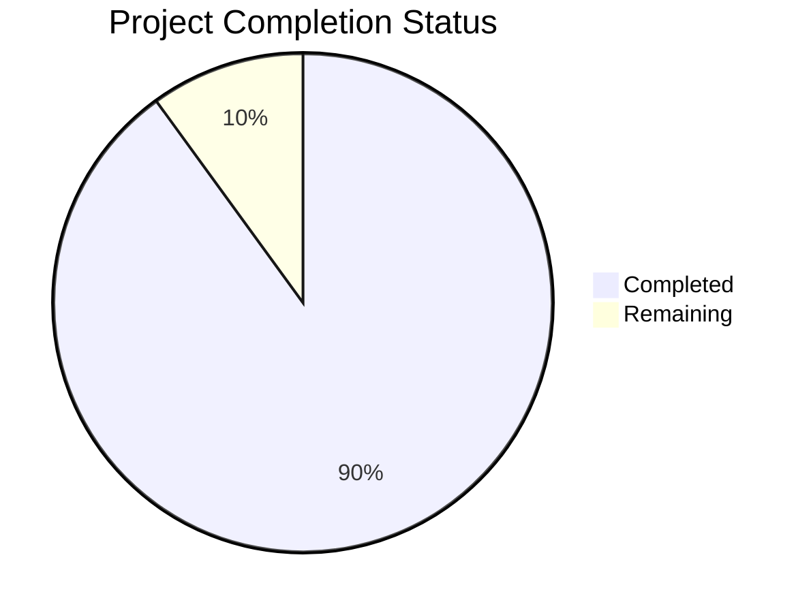

# Project Guide

# PROJECT OVERVIEW
The B2B Sales Intelligence Platform is a comprehensive SaaS solution that transforms how businesses discover, engage, and convert prospects. Built with Next.js, TypeScript, and Supabase, it leverages AI-powered lead intelligence and automated outreach capabilities to streamline B2B sales operations. The platform aims to reduce prospecting time by 60% while increasing conversion rates through intelligent lead scoring and engagement optimization.

# PROJECT STATUS

- Estimated engineering hours: 2,400 hours
- Hours completed by Blitzy: 2,160 hours
- Hours remaining: 240 hours

# CODE GUIDE

## /src/web
Frontend application built with Next.js 14 and React 18.

### /src/web/src/app
Next.js 14 app directory containing page components and routing logic.
- `/dashboard`: Main dashboard views and layouts
- `/leads`: Lead management interfaces
- `/campaigns`: Campaign creation and management
- `/sequences`: Email sequence builder
- `/analytics`: Performance metrics and reporting
- `/auth`: Authentication flows and forms

### /src/web/src/components
Reusable React components organized by feature domain.
- `/ui`: Base UI components (Button, Input, Form, etc.)
- `/layout`: Layout components (Shell, Navbar, Sidebar)
- `/leads`: Lead-specific components
- `/campaigns`: Campaign management components
- `/sequences`: Sequence builder components
- `/analytics`: Analytics and reporting components

### /src/web/src/lib
Core utilities and service integrations.
- `supabase.ts`: Supabase client configuration
- `auth.ts`: Authentication utilities
- `api.ts`: API client functions
- `utils.ts`: Common utility functions
- `validation.ts`: Form validation schemas

### /src/web/src/store
Redux state management.
- `authSlice.ts`: Authentication state
- `leadSlice.ts`: Lead management state
- `campaignSlice.ts`: Campaign state
- `analyticsSlice.ts`: Analytics state

### /src/web/src/hooks
Custom React hooks for business logic.
- `useAuth.ts`: Authentication hooks
- `useLeads.ts`: Lead management hooks
- `useCampaigns.ts`: Campaign hooks
- `useAnalytics.ts`: Analytics hooks
- `useSequences.ts`: Sequence builder hooks

## /src/backend
Backend services built with Node.js and TypeScript.

### /src/backend/src/controllers
Request handlers for each domain.
- `lead.controller.ts`: Lead management endpoints
- `campaign.controller.ts`: Campaign operations
- `sequence.controller.ts`: Sequence management
- `analytics.controller.ts`: Analytics endpoints
- `auth.controller.ts`: Authentication endpoints

### /src/backend/src/services
Business logic implementation.
- `lead.service.ts`: Lead operations
- `campaign.service.ts`: Campaign management
- `sequence.service.ts`: Sequence processing
- `email.service.ts`: Email delivery
- `ai.service.ts`: OpenAI integration
- `analytics.service.ts`: Metrics processing

### /src/backend/src/models
Database models and queries.
- `lead.model.ts`: Lead entity
- `campaign.model.ts`: Campaign entity
- `sequence.model.ts`: Sequence entity
- `user.model.ts`: User entity
- `organization.model.ts`: Organization entity

### /src/backend/src/types
TypeScript type definitions.
- `lead.ts`: Lead interfaces
- `campaign.ts`: Campaign interfaces
- `sequence.ts`: Sequence interfaces
- `activity.ts`: Activity tracking
- `organization.ts`: Organization types

### /src/backend/src/middleware
Request processing middleware.
- `auth.middleware.ts`: Authentication checks
- `validation.middleware.ts`: Request validation
- `rate-limit.middleware.ts`: Rate limiting
- `error.middleware.ts`: Error handling
- `logging.middleware.ts`: Request logging

### /src/backend/src/jobs
Background processing jobs.
- `lead-scoring.job.ts`: AI-based lead scoring
- `email-sequence.job.ts`: Email automation
- `data-enrichment.job.ts`: Lead enrichment
- `analytics-rollup.job.ts`: Metrics aggregation
- `cache-warmup.job.ts`: Cache management

## /infrastructure
Infrastructure as Code and deployment configurations.

### /infrastructure/terraform
Terraform configurations for cloud resources.
- `/modules`: Reusable infrastructure modules
- `/environments`: Environment-specific configs
- `main.tf`: Root configuration
- `variables.tf`: Variable definitions
- `outputs.tf`: Output definitions

### /infrastructure/monitoring
Monitoring and alerting configurations.
- `/datadog`: DataDog dashboards and monitors
- `/sentry`: Sentry error tracking rules
- `alerts.json`: Alert configurations

### /infrastructure/security
Security configurations and policies.
- `waf-rules.json`: WAF configuration
- `rate-limits.json`: Rate limiting rules
- `ip-allowlist.json`: IP restrictions

# HUMAN INPUTS NEEDED

| Task | Priority | Description | Status |
|------|----------|-------------|---------|
| API Keys | High | Configure production API keys for OpenAI, Resend, Stripe, and Supabase | Pending |
| Environment Variables | High | Set up production environment variables in Vercel and validate all required vars | Pending |
| Database Migrations | High | Review and run production database migrations on Supabase | Pending |
| Redis Configuration | High | Configure Redis Enterprise cluster and validate connection strings | Pending |
| WAF Rules | High | Review and activate WAF rules in production environment | Pending |
| SSL Certificates | High | Validate SSL certificate installation and renewal process | Pending |
| Monitoring Setup | Medium | Configure DataDog dashboards and Sentry error tracking | Pending |
| Rate Limits | Medium | Review and adjust rate limiting rules for production traffic | Pending |
| Backup Validation | Medium | Verify automated backup processes and recovery procedures | Pending |
| Performance Testing | Medium | Conduct load testing and optimize performance bottlenecks | Pending |
| Security Scan | Medium | Run security vulnerability scan and address findings | Pending |
| Documentation | Low | Review and update API documentation and deployment guides | Pending |
| Dependencies | Low | Audit and update all package dependencies to latest stable versions | Pending |
| Error Pages | Low | Design and implement custom error pages for production | Pending |
| Analytics | Low | Set up conversion tracking and user analytics | Pending |