# Technical Specifications

# 1. INTRODUCTION

## 1.1 EXECUTIVE SUMMARY

The B2B sales intelligence and engagement platform is a comprehensive SaaS solution designed to transform how businesses discover, engage, and convert prospects. By combining AI-powered lead intelligence with automated outreach capabilities, the platform addresses the critical challenge of efficiently scaling personalized B2B sales operations. Primary stakeholders include sales representatives, marketing teams, and business development professionals seeking to streamline their prospecting and outreach workflows. The platform is expected to reduce prospecting time by 60% while increasing conversion rates through intelligent lead scoring and engagement optimization.

## 1.2 SYSTEM OVERVIEW

### Project Context

| Aspect | Details |
|--------|----------|
| Market Position | Enterprise-grade sales intelligence platform competing in the $5B+ sales enablement market |
| Current Limitations | Manual prospecting processes, fragmented tools, lack of data-driven insights |
| Enterprise Integration | Seamless integration with major CRM platforms (Salesforce, HubSpot) and email providers |

### High-Level Description

| Component | Implementation |
|-----------|----------------|
| Lead Intelligence | AI-powered search and enrichment using OpenAI GPT-4 |
| Email Automation | Serverless email sequencing via Resend |
| Data Platform | Scalable PostgreSQL database on Supabase |
| Frontend | Next.js with TailwindCSS and Shadcn components |

### Success Criteria

| KPI | Target |
|-----|--------|
| User Adoption | 80% active user rate within 30 days |
| Lead Quality | 40% improvement in conversion rates |
| Time Savings | 60% reduction in prospecting time |
| ROI | 3x return on investment within 6 months |

## 1.3 SCOPE

### In-Scope Elements

#### Core Features

| Feature Category | Capabilities |
|-----------------|--------------|
| Lead Management | - AI-powered search and filtering<br>- Contact data enrichment<br>- Lead scoring and prioritization |
| Email Automation | - Template management<br>- Sequence builder<br>- A/B testing engine |
| Analytics | - Campaign performance tracking<br>- Conversion analytics<br>- ROI calculation |
| Integrations | - CRM synchronization<br>- Email service connections<br>- API access |

#### Implementation Boundaries

| Boundary Type | Coverage |
|--------------|----------|
| User Groups | Sales teams, marketing specialists, business development |
| Geographic Coverage | North America, Europe, Asia-Pacific |
| Data Domains | Company data, contact information, engagement metrics |
| Security Scope | SOC 2, GDPR, CCPA compliance |

### Out-of-Scope Elements

| Category | Excluded Elements |
|----------|------------------|
| Features | - Social media management<br>- Content creation tools<br>- Meeting scheduling |
| Integrations | - ERP systems<br>- Project management tools<br>- Marketing automation platforms |
| Use Cases | - Consumer (B2C) sales<br>- Retail point-of-sale<br>- Customer support operations |
| Future Phases | - Mobile application<br>- Advanced reporting suite<br>- Custom AI model training |

# 2. SYSTEM ARCHITECTURE

## 2.1 High-Level Architecture

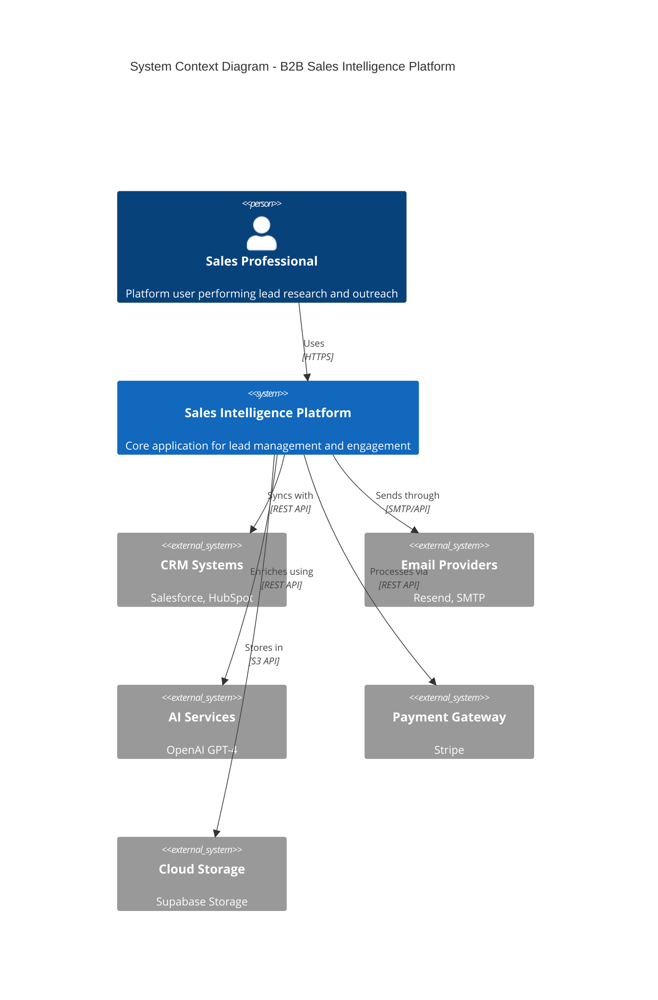

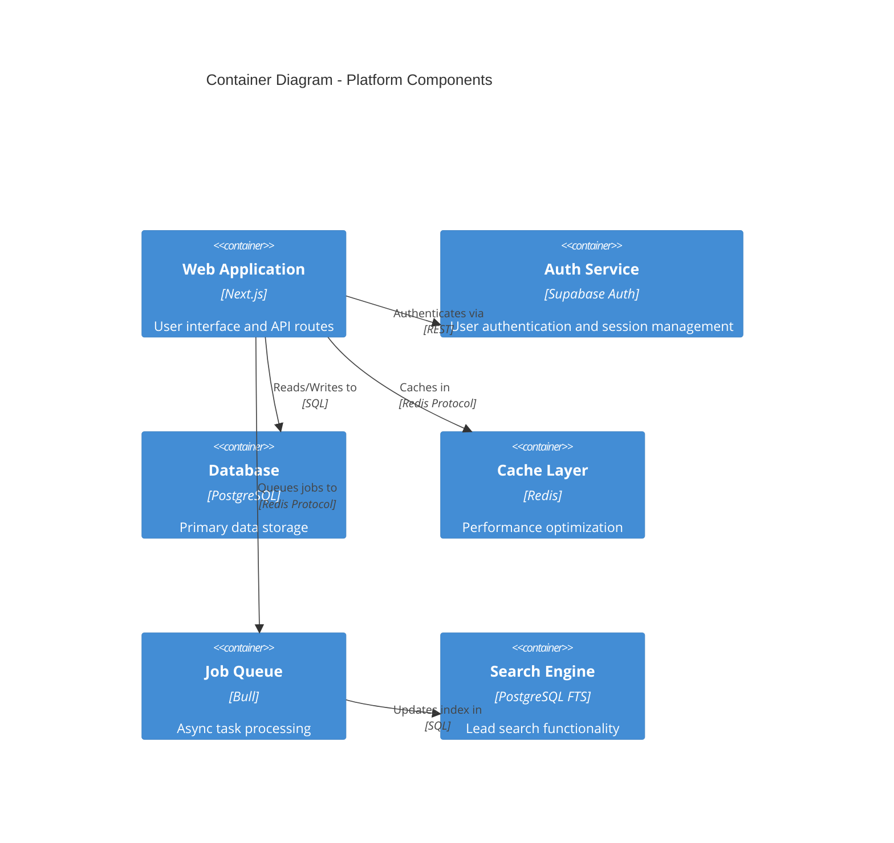

## 2.2 Component Details

### Core Components

| Component | Purpose | Technology | Scaling Strategy |
|-----------|---------|------------|------------------|
| Web Application | User interface and API endpoints | Next.js, React | Horizontal scaling via Vercel |
| Authentication | User identity management | Supabase Auth | Built-in scaling with Supabase |
| Database | Primary data storage | PostgreSQL | Vertical scaling + Read replicas |
| Search Engine | Lead discovery and filtering | PostgreSQL FTS | Dedicated search instances |
| Job Queue | Async task processing | Bull + Redis | Multiple worker processes |
| Cache Layer | Performance optimization | Redis | Cluster mode with sharding |

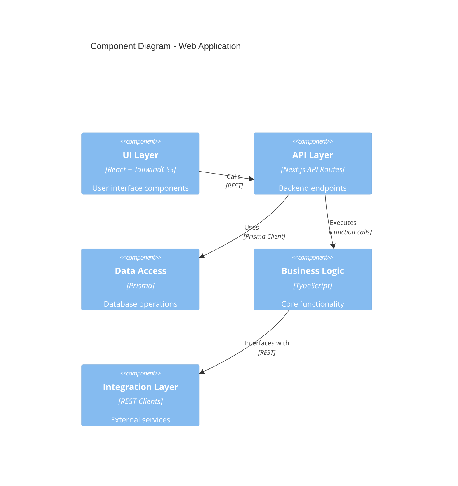

## 2.3 Technical Decisions

### Architecture Choices

| Decision | Choice | Rationale |
|----------|--------|-----------|
| Architecture Style | Monolithic with service boundaries | Simplifies deployment while maintaining modularity |
| Communication | REST + WebSocket | Real-time updates with standard HTTP fallback |
| Data Storage | PostgreSQL + Redis | Strong consistency with caching for performance |
| API Design | REST + GraphQL | Flexible data fetching with standardized mutations |
| Deployment | Serverless | Cost-effective scaling and management |

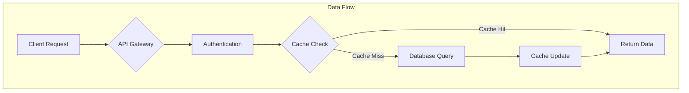

## 2.4 Cross-Cutting Concerns

### Monitoring and Security

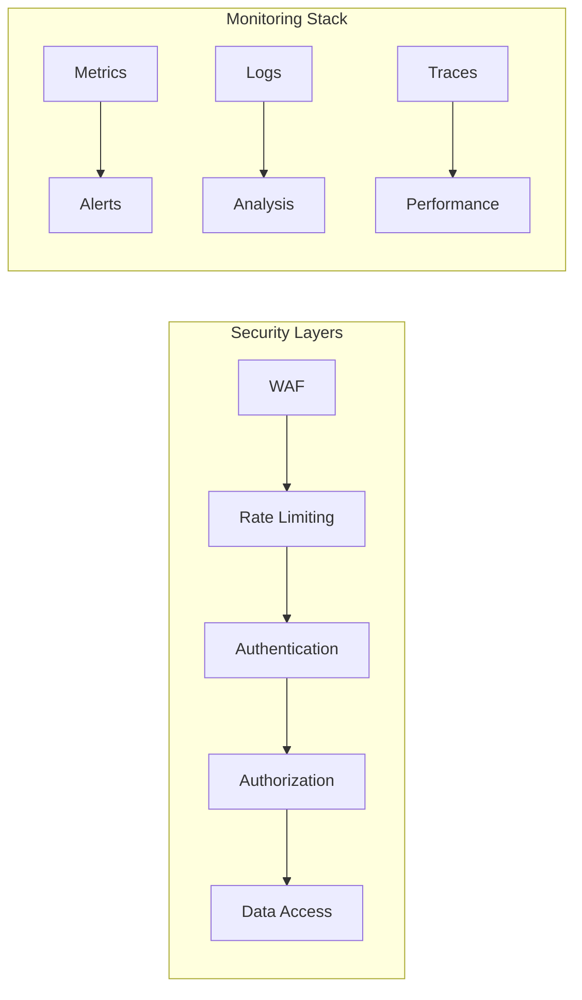

### Implementation Details

| Concern | Implementation | Technology |
|---------|----------------|------------|
| Monitoring | Distributed tracing | OpenTelemetry |
| Logging | Structured logging | Winston + Papertrail |
| Error Handling | Global error boundary | Sentry |
| Authentication | JWT + Session | Supabase Auth |
| Authorization | RBAC | Custom middleware |

## 2.5 Deployment Architecture

```mermaid
C4Deployment
    title Deployment Diagram

    Deployment_Node(cdn, "CDN", "Vercel Edge Network") {
        Container(static, "Static Assets", "Next.js static files")
    }
    
    Deployment_Node(compute, "Compute Layer", "Vercel Serverless") {
        Container(app, "Application", "Next.js SSR + API")
    }
    
    Deployment_Node(data, "Data Layer", "Supabase") {
        Container(db, "Database", "PostgreSQL")
        Container(auth, "Auth", "GoTrue")
    }
    
    Deployment_Node(cache, "Cache Layer", "Redis Labs") {
        Container(redis, "Redis Cluster", "Redis")
    }
    
    Rel(cdn, compute, "Routes to", "HTTPS")
    Rel(compute, data, "Connects to", "SSL")
    Rel(compute, cache, "Caches in", "SSL")
```

# 3. SYSTEM COMPONENTS ARCHITECTURE

## 3.1 USER INTERFACE DESIGN

### Design System Specifications

| Component | Specification | Implementation |
|-----------|--------------|----------------|
| Typography | Scale: 12-48px | Tailwind font sizes |
| Colors | Primary: #2563eb<br>Secondary: #64748b<br>Accent: #0ea5e9 | Tailwind color palette |
| Spacing | 4px base unit, 4-64px scale | Tailwind spacing scale |
| Breakpoints | Mobile: 320px<br>Tablet: 768px<br>Desktop: 1024px<br>Wide: 1440px | Tailwind breakpoints |
| Shadows | 3 levels: sm, md, lg | Shadcn preset shadows |
| Animations | Duration: 150-300ms<br>Easing: cubic-bezier | Tailwind transitions |

### Accessibility Requirements

| Requirement | Implementation | Standard |
|-------------|----------------|-----------|
| Color Contrast | WCAG 2.1 AA (4.5:1) | Automated testing |
| Keyboard Navigation | Full keyboard support | Focus management |
| Screen Readers | ARIA labels and roles | Shadcn components |
| Reduced Motion | prefers-reduced-motion | CSS media query |
| Font Scaling | Support 200% zoom | Relative units |

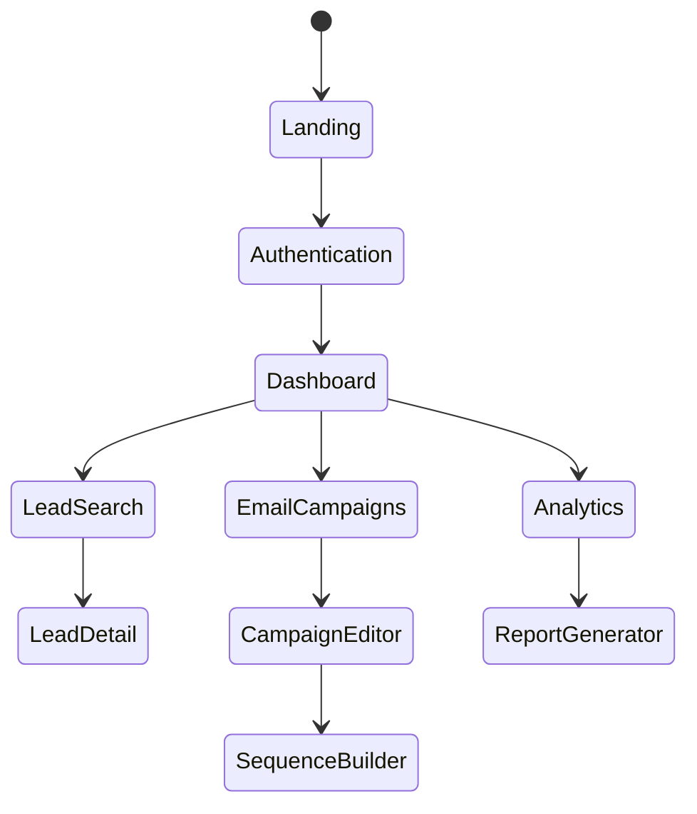

### Component Architecture

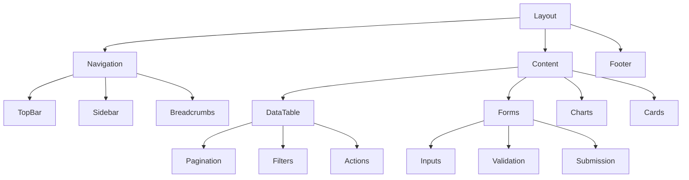

## 3.2 DATABASE DESIGN

### Schema Design

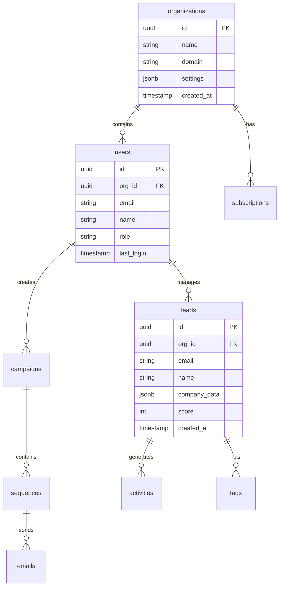

### Data Management Strategy

| Aspect | Strategy | Implementation |
|--------|----------|----------------|
| Partitioning | By organization_id | Declarative partitioning |
| Indexing | Covering indexes for common queries | B-tree + GiST |
| Caching | Two-level: Redis + PostgreSQL | Cache-aside pattern |
| Archival | Monthly partitions older than 1 year | pg_partman |
| Backup | Continuous WAL archiving | pg_basebackup |
| Encryption | Column-level for PII | pgcrypto |

### Performance Optimization

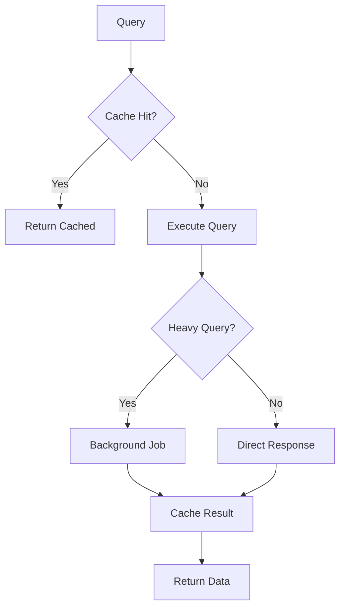

## 3.3 API DESIGN

### API Architecture

| Component | Specification | Implementation |
|-----------|--------------|----------------|
| Protocol | REST + GraphQL | Next.js API routes |
| Authentication | JWT + API Keys | Supabase Auth |
| Rate Limiting | 1000 req/min per user | Upstash Redis |
| Versioning | URI-based (/v1/) | Express middleware |
| Documentation | OpenAPI 3.0 | Swagger UI |
| Caching | ETags + Cache-Control | Redis |

### Endpoint Specifications

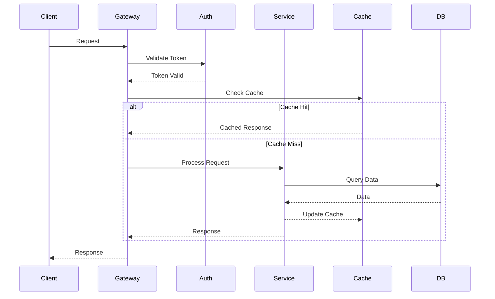

### Integration Patterns

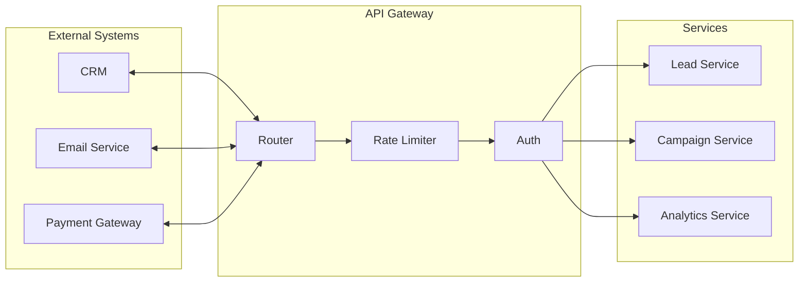

### Security Controls

| Control | Implementation | Purpose |
|---------|----------------|---------|
| Authentication | JWT + OAuth2 | Identity verification |
| Authorization | RBAC + ABAC | Access control |
| Rate Limiting | Token bucket | Abuse prevention |
| Input Validation | Zod schemas | Data integrity |
| Output Encoding | HTML escaping | XSS prevention |
| API Scanning | OWASP ZAP | Vulnerability detection |

# 4. TECHNOLOGY STACK

## 4.1 PROGRAMMING LANGUAGES

| Language | Version | Usage | Justification |
|----------|---------|-------|---------------|
| TypeScript | 5.2+ | Frontend, API Routes | - Strong typing for complex data models<br>- Enhanced IDE support<br>- Reduced runtime errors |
| SQL | PostgreSQL 15+ | Database Queries | - Complex data relationships<br>- Full-text search capabilities<br>- JSONB support for flexible schemas |
| Python | 3.11+ | AI Processing Scripts | - Rich AI/ML libraries<br>- OpenAI SDK support<br>- Data processing capabilities |

## 4.2 FRAMEWORKS & LIBRARIES

### Core Frameworks

| Framework | Version | Purpose | Justification |
|-----------|---------|---------|---------------|
| Next.js | 14.0+ | Full-stack Framework | - Server-side rendering<br>- API routes integration<br>- Optimized build output |
| React | 18.2+ | UI Library | - Component reusability<br>- Virtual DOM performance<br>- Rich ecosystem |
| TailwindCSS | 3.3+ | Styling | - Utility-first approach<br>- Zero runtime CSS<br>- Responsive design system |

### Supporting Libraries

| Library | Version | Purpose | Dependencies |
|---------|---------|---------|--------------|
| Prisma | 5.x | ORM | - PostgreSQL adapter<br>- TypeScript types |
| React Query | 5.x | Data Fetching | - React 18+<br>- TypeScript 5.0+ |
| Zod | 3.x | Schema Validation | - TypeScript 4.5+ |
| Shadcn/ui | 0.5+ | UI Components | - TailwindCSS 3.2+<br>- React 18+ |

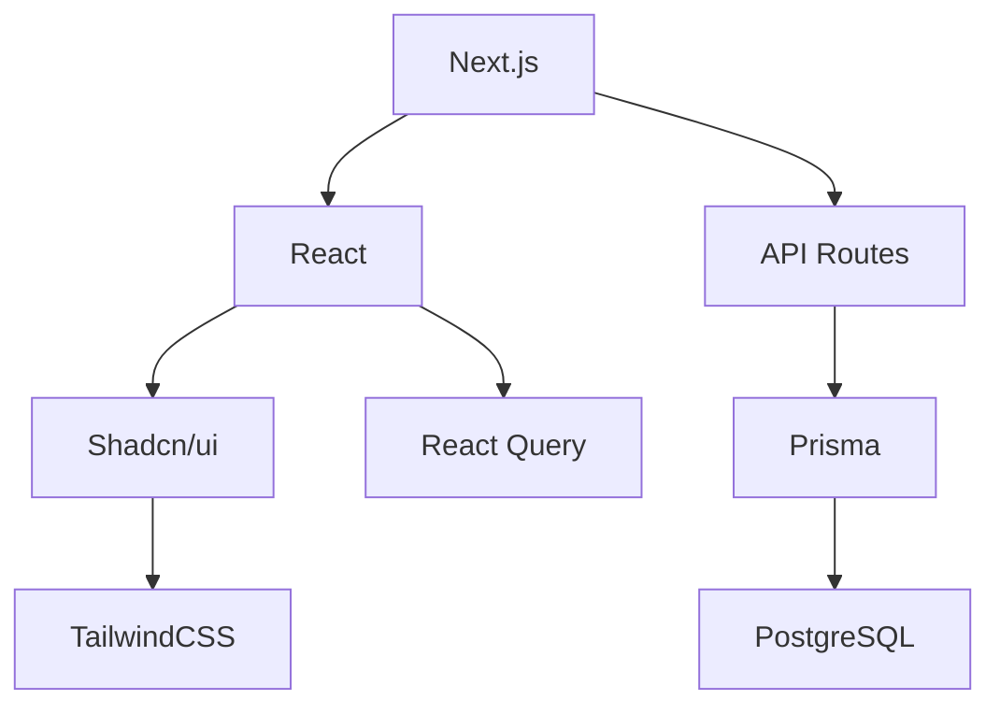

## 4.3 DATABASES & STORAGE

### Primary Database

| Component | Technology | Purpose |
|-----------|------------|---------|
| Main Database | Supabase PostgreSQL | - Relational data storage<br>- Full-text search<br>- Real-time subscriptions |
| Cache Layer | Redis | - Session storage<br>- API response caching<br>- Rate limiting |
| File Storage | Supabase Storage | - Email attachments<br>- User uploads<br>- Document storage |

### Data Strategy

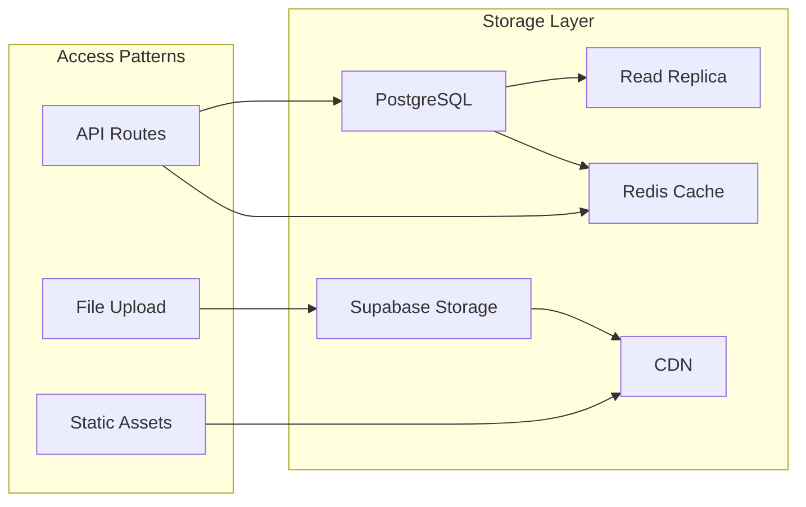

## 4.4 THIRD-PARTY SERVICES

| Service | Purpose | Integration Method |
|---------|---------|-------------------|
| OpenAI | Lead scoring & enrichment | REST API + SDK |
| Resend | Email delivery | API + Webhooks |
| Stripe | Payment processing | SDK + Webhooks |
| Supabase | Auth & database | SDK + REST API |
| Vercel | Hosting & deployment | Git integration |

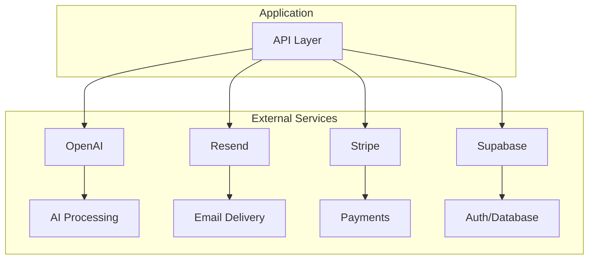

## 4.5 DEVELOPMENT & DEPLOYMENT

### Development Environment

| Tool | Purpose | Configuration |
|------|---------|--------------|
| VS Code | IDE | - TypeScript support<br>- ESLint integration<br>- Prettier formatting |
| pnpm | Package Manager | - Workspace support<br>- Fast installation<br>- Disk efficiency |
| Docker | Local Development | - PostgreSQL container<br>- Redis container<br>- Mailhog for email testing |

### Deployment Pipeline

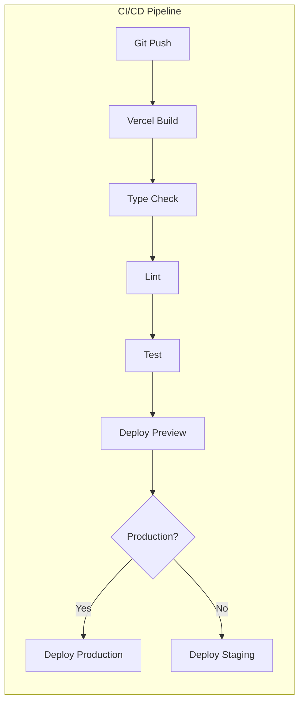

### Infrastructure Requirements

| Component | Specification | Scaling Strategy |
|-----------|--------------|------------------|
| Web Servers | Vercel Edge Network | Auto-scaling |
| Database | Supabase Enterprise | Vertical + Read replicas |
| Cache | Redis Enterprise | Cluster with sharding |
| Storage | S3-compatible | CDN distribution |

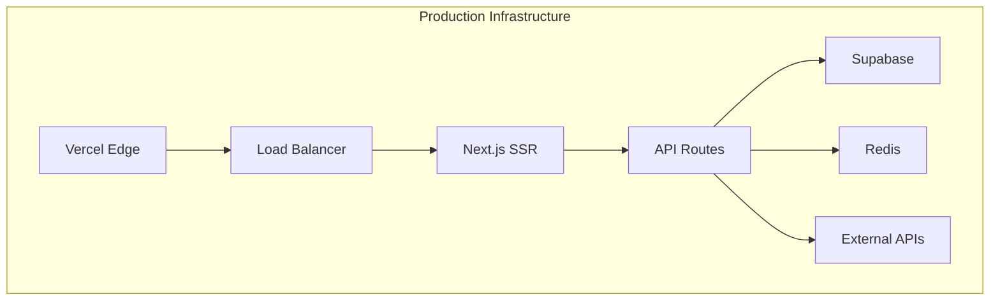

# 5. SYSTEM DESIGN

## 5.1 USER INTERFACE DESIGN

### Layout Structure

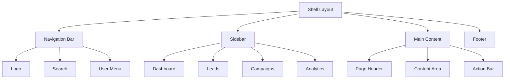

### Component Hierarchy

| Component | Children | Purpose |
|-----------|----------|---------|
| Shell | Navigation, Sidebar, Content | Main application wrapper |
| Navigation | Logo, Search, UserMenu | Top-level navigation |
| Sidebar | Menu Items, Collapse Button | Context navigation |
| Content | Header, Main, Footer | Page content container |
| DataTable | Pagination, Filters, Actions | Data display component |
| Forms | Inputs, Validation, Submit | Data input interfaces |

### Responsive Breakpoints

| Breakpoint | Size | Layout Changes |
|------------|------|----------------|
| Mobile | < 768px | Single column, hidden sidebar |
| Tablet | 768px - 1024px | Collapsed sidebar, fluid grid |
| Desktop | 1024px - 1440px | Extended sidebar, fixed width |
| Wide | > 1440px | Maximum width container |

## 5.2 DATABASE DESIGN

### Schema Design

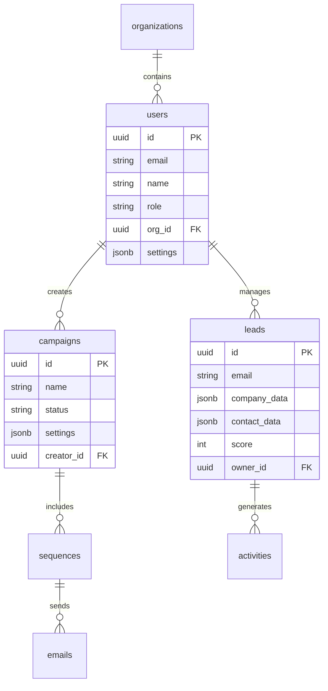

### Data Models

| Model | Indexes | Partitioning | Relationships |
|-------|---------|--------------|---------------|
| users | email, org_id | None | organizations, leads |
| leads | email, score | org_id | users, activities |
| campaigns | status, created_at | org_id | sequences, users |
| sequences | campaign_id | org_id | emails, campaigns |
| activities | lead_id, type | org_id | leads |

### Storage Strategy

| Data Type | Storage | Backup | Retention |
|-----------|---------|--------|------------|
| User Data | PostgreSQL | Daily | Indefinite |
| Lead Data | PostgreSQL + Search | Weekly | 24 months |
| Campaign Data | PostgreSQL | Daily | 12 months |
| Activity Logs | TimescaleDB | Monthly | 6 months |

## 5.3 API DESIGN

### REST Endpoints

| Endpoint | Method | Purpose | Authentication |
|----------|--------|---------|----------------|
| /api/leads | GET, POST | Lead management | JWT |
| /api/campaigns | GET, POST | Campaign operations | JWT |
| /api/sequences | GET, POST | Sequence management | JWT |
| /api/analytics | GET | Performance data | JWT |

### WebSocket Events

| Event | Direction | Purpose | Payload |
|-------|-----------|---------|---------|
| lead.updated | Server → Client | Real-time lead updates | Lead object |
| campaign.status | Server → Client | Campaign status changes | Status object |
| activity.new | Server → Client | New lead activity | Activity object |

### Integration Architecture

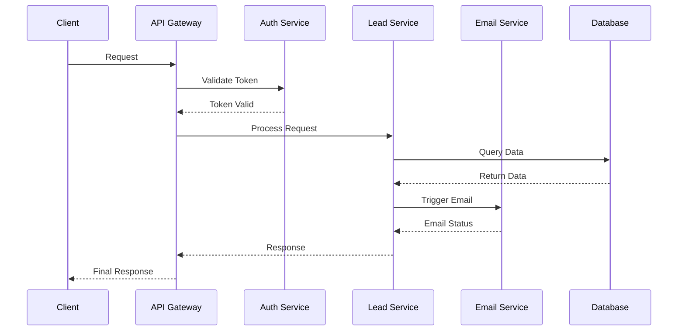

### Rate Limiting

| Endpoint Type | Limit | Window | Overage Behavior |
|--------------|-------|--------|------------------|
| Standard API | 100 | 1 minute | 429 Response |
| Bulk Operations | 1000 | 1 hour | Queue |
| Search Queries | 50 | 1 minute | 429 Response |
| Webhooks | 500 | 1 hour | Drop |

### Error Handling

```mermaid
flowchart TD
    A[Request] --> B{Validate}
    B -->|Invalid| C[400 Bad Request]
    B -->|Valid| D{Authenticate}
    D -->|Failed| E[401 Unauthorized]
    D -->|Success| F{Process}
    F -->|Error| G[500 Server Error]
    F -->|Success| H[200 Success]
    G --> I[Error Logging]
    I --> J[Alert System]
```

# 6. USER INTERFACE DESIGN

## 6.1 Design System

### Component Key
```
Icons:                UI Elements:
[?] Help              [ ] Checkbox
[$] Payment           ( ) Radio
[i] Info             [...] Text Input
[+] Add              [Button] Button
[x] Close            [v] Dropdown
[<] [>] Navigate     [====] Progress
[^] Upload           {Tab} Active Tab
[#] Dashboard        {-Tab-} Inactive
[@] Profile          
[!] Alert            
[=] Settings         
[*] Favorite         
```

## 6.2 Core Layouts

### Dashboard Layout
```
+----------------------------------------------------------+
|  [#] B2B Sales Platform                [@] Admin  [=]      |
+----------------------------------------------------------+
|                                                           |
| +----------------+ +--------------------------------+      |
| | [#] Dashboard  | | Welcome back, John             |      |
| | [*] Leads      | |                               |      |
| | [$] Campaigns  | | Quick Stats:                   |      |
| | [@] Contacts   | | +------------+ +------------+  |      |
| | [i] Analytics  | | | Leads: 150 | |Emails: 45  |  |      |
| | [=] Settings   | | +------------+ +------------+  |      |
| +----------------+ |                               |      |
|                    +--------------------------------+      |
+----------------------------------------------------------+
```

### Lead Search Interface
```
+----------------------------------------------------------+
| Leads Database                           [+] Add Lead      |
+----------------------------------------------------------+
| Search: [...........................] [Button: Search]      |
|                                                           |
| Filters:                                                  |
| Industry: [v]          Company Size: [v]    Score: [v]    |
|                                                           |
| +------------------+--------+----------+--------+-------+  |
| | Name             | Title  | Company  | Score  |Action |  |
| +------------------+--------+----------+--------+-------+  |
| | John Smith       | CEO    | TechCo   | 85     |[...] |  |
| | Sarah Johnson    | CTO    | DevInc   | 92     |[...] |  |
| | Michael Brown    | VP     | SaaS Ltd | 78     |[...] |  |
| +------------------+--------+----------+--------+-------+  |
|                                                           |
| [<] 1 2 3 ... 10 [>]                                     |
+----------------------------------------------------------+
```

### Email Campaign Builder
```
+----------------------------------------------------------+
| Campaign Builder                    [Button: Save Draft]    |
+----------------------------------------------------------+
| {Tab} Details {-Tab-} Sequence {-Tab-} Preview            |
|                                                           |
| Campaign Name: [..............................]            |
|                                                           |
| Target Audience:                                          |
| ( ) All Leads                                            |
| ( ) Filtered List                                        |
| ( ) Custom Selection                                      |
|                                                           |
| Email Sequence:                                           |
| +--------------------+                                    |
| | Day 1: Introduction|                                    |
| | +-- Wait 2 days    |                                    |
| | Day 3: Follow-up   |                                    |
| | +-- If opened      |                                    |
| |   +-- Send Offer   |                                    |
| +--------------------+                                    |
|                                                           |
| [Button: Add Step] [Button: Preview] [Button: Launch]     |
+----------------------------------------------------------+
```

### Analytics Dashboard
```
+----------------------------------------------------------+
| Performance Analytics                    [^] Export Data   |
+----------------------------------------------------------+
| Time Range: [v Last 30 Days]                              |
|                                                           |
| +-------------------+  +----------------------+           |
| | Lead Conversion   |  | Email Performance    |           |
| | [====== ] 65%     |  | Open Rate: 28%       |           |
| +-------------------+  | Click Rate: 12%      |           |
|                       +----------------------+           |
|                                                           |
| Campaign Performance:                                     |
| +------------------+--------+---------+----------------+  |
| | Campaign         | Sent   | Opens   | Conversions    |  |
| +------------------+--------+---------+----------------+  |
| | Q4 Outreach      | 1,500  | 425     | 48             |  |
| | Product Launch   | 2,200  | 682     | 95             |  |
| +------------------+--------+---------+----------------+  |
+----------------------------------------------------------+
```

## 6.3 Responsive Behavior

### Mobile Layout (<768px)
```
+----------------------+
| [=] B2B Sales        |
+----------------------+
| [@] John Smith       |
+----------------------+
| [#] Menu             |
| +-- Dashboard        |
| +-- Leads           |
| +-- Campaigns       |
| +-- Analytics       |
+----------------------+
| Content Area         |
|                      |
| [Button: Action]     |
+----------------------+
```

### Tablet Layout (768px-1024px)
```
+--------------------------------+
| [#] B2B Sales      [@] Profile |
+--------------------------------+
| +----------+ +---------------+ |
| | Nav      | | Content       | |
| | Dashboard| |               | |
| | Leads    | | [Data Table]  | |
| | Campaigns| |               | |
| +----------+ +---------------+ |
+--------------------------------+
```

## 6.4 Component States

### Button States
```
Normal:    [Button: Action]
Hover:     [Button: Action]*
Active:    [Button: Action]!
Disabled:  [Button: Action]...
Loading:   [Button: ====]
```

### Form Validation
```
+-------------------------+
| Email:                  |
| [...................] |
| [!] Invalid email      |
+-------------------------+
| Password:              |
| [...................] |
| [✓] Strong password    |
+-------------------------+
```

### Loading States
```
+-------------------------+
| Loading Data...         |
| [=====>    ] 60%       |
|                        |
| [░░░░░░    ]          |
| [▒▒▒▒      ]          |
| [▓▓▓       ]          |
+-------------------------+
```

# 7. SECURITY CONSIDERATIONS

## 7.1 AUTHENTICATION AND AUTHORIZATION

### Authentication Methods

| Method | Implementation | Use Case |
|--------|----------------|----------|
| JWT Tokens | Supabase Auth | Primary session management |
| OAuth 2.0 | Google, LinkedIn providers | SSO integration |
| API Keys | Secure hash + prefix | External API access |
| MFA | TOTP via Supabase Auth | Enhanced account security |

### Authorization Model

```mermaid
flowchart TD
    A[Request] --> B{Authenticated?}
    B -->|No| C[401 Unauthorized]
    B -->|Yes| D{Role Check}
    D -->|Admin| E[Full Access]
    D -->|Manager| F[Team Access]
    D -->|User| G[Limited Access]
    D -->|API| H[Rate Limited Access]
    
    E --> I{Resource Check}
    F --> I
    G --> I
    H --> I
    
    I -->|Allowed| J[Grant Access]
    I -->|Denied| K[403 Forbidden]
```

### Role-Based Access Control (RBAC)

| Role | Permissions | Scope |
|------|------------|-------|
| Admin | Full system access | Global |
| Manager | Team management, reporting | Organization |
| User | Lead management, campaigns | Personal |
| API | Endpoint-specific access | Rate-limited |

## 7.2 DATA SECURITY

### Encryption Strategy

| Layer | Method | Implementation |
|-------|--------|----------------|
| Data at Rest | AES-256-GCM | Supabase Column Encryption |
| Data in Transit | TLS 1.3 | Vercel Edge Network |
| Secrets | KMS | Vercel Environment Variables |
| PII Data | Field-level encryption | Custom encryption service |

### Data Classification

```mermaid
flowchart LR
    subgraph "Data Classification"
        A[Public] --> B[Internal]
        B --> C[Confidential]
        C --> D[Restricted]
    end
    
    subgraph "Security Controls"
        E[Basic] --> F[Standard]
        F --> G[Enhanced]
        G --> H[Maximum]
    end
    
    A --- E
    B --- F
    C --- G
    D --- H
```

### Backup and Recovery

| Type | Frequency | Retention | Storage |
|------|-----------|-----------|---------|
| Full Backup | Daily | 30 days | Encrypted S3 |
| Incremental | Hourly | 7 days | Supabase Storage |
| Transaction Logs | Real-time | 24 hours | Secure archive |
| Point-in-time Recovery | Continuous | 7 days | PostgreSQL WAL |

## 7.3 SECURITY PROTOCOLS

### Security Layers

```mermaid
flowchart TD
    subgraph "Security Architecture"
        A[WAF] --> B[Rate Limiting]
        B --> C[Authentication]
        C --> D[Authorization]
        D --> E[Data Access]
        
        F[Security Monitoring] --> G[Alerts]
        H[Audit Logging] --> I[Analysis]
        J[Threat Detection] --> K[Response]
    end
```

### Security Controls

| Control | Implementation | Monitoring |
|---------|----------------|------------|
| WAF | Vercel Edge Functions | Real-time alerts |
| DDoS Protection | Rate limiting + Cloudflare | Traffic analysis |
| Input Validation | Zod schemas | Validation errors |
| XSS Prevention | Content Security Policy | Security headers |
| CSRF Protection | Double-submit cookies | Token validation |

### Compliance Requirements

| Standard | Requirements | Implementation |
|----------|--------------|----------------|
| GDPR | Data privacy, consent | Privacy controls, data deletion |
| SOC 2 | Security controls | Audit logs, access controls |
| CCPA | Data rights | User data portal |
| PCI DSS | Payment security | Stripe integration |

### Security Monitoring

| Component | Tool | Alert Threshold |
|-----------|------|----------------|
| Error Tracking | Sentry | Error rate > 1% |
| Access Logs | Supabase Logs | Suspicious patterns |
| Performance | Vercel Analytics | Response time > 500ms |
| Security Events | Custom monitoring | Any security violation |

```mermaid
flowchart LR
    subgraph "Security Monitoring Flow"
        A[Event Collection] --> B{Analysis}
        B -->|Normal| C[Logging]
        B -->|Suspicious| D[Alert]
        D --> E[Investigation]
        E -->|Threat| F[Response]
        E -->|False Positive| G[Update Rules]
    end
```

# 8. INFRASTRUCTURE

## 8.1 DEPLOYMENT ENVIRONMENT

| Environment | Configuration | Purpose |
|-------------|--------------|----------|
| Development | Vercel Preview Deployments | Feature development and testing |
| Staging | Vercel Preview + Production DB Mirror | Pre-release validation |
| Production | Vercel Edge Network + Supabase Enterprise | Live system |

### Environment Configuration

```mermaid
flowchart TD
    subgraph "Production Environment"
        A[Vercel Edge Network] --> B[Next.js Application]
        B --> C[Supabase Enterprise]
        B --> D[Redis Enterprise]
        B --> E[External Services]
    end
    
    subgraph "External Services"
        F[OpenAI]
        G[Resend]
        H[Stripe]
    end
    
    subgraph "Monitoring"
        I[Vercel Analytics]
        J[Sentry]
        K[DataDog]
    end
```

## 8.2 CLOUD SERVICES

| Service | Provider | Purpose | Justification |
|---------|----------|---------|---------------|
| Edge Hosting | Vercel | Application hosting and SSR | - Global edge network<br>- Next.js optimization<br>- Automatic scaling |
| Database | Supabase | Data storage and auth | - PostgreSQL compatibility<br>- Real-time capabilities<br>- Built-in auth |
| Cache | Redis Labs | Session and data caching | - High performance<br>- Managed service<br>- Global distribution |
| Storage | Supabase Storage | File and asset storage | - S3 compatibility<br>- Direct integration<br>- CDN capabilities |
| Email | Resend | Transactional email delivery | - High deliverability<br>- Analytics<br>- Webhook support |

## 8.3 CONTAINERIZATION

### Docker Configuration

```mermaid
flowchart LR
    subgraph "Local Development"
        A[Docker Compose] --> B[Next.js Container]
        A --> C[PostgreSQL Container]
        A --> D[Redis Container]
        A --> E[Mailhog Container]
    end
    
    subgraph "CI Environment"
        F[GitHub Actions] --> G[Test Container]
        F --> H[Build Container]
    end
```

| Container | Base Image | Purpose |
|-----------|------------|---------|
| Application | node:18-alpine | Next.js application |
| Database | postgres:15-alpine | Local development database |
| Cache | redis:7-alpine | Local development cache |
| Mail | mailhog/mailhog | Local email testing |

## 8.4 ORCHESTRATION

While traditional container orchestration (Kubernetes) is not required due to the serverless architecture, the following deployment orchestration is implemented:

| Component | Tool | Purpose |
|-----------|------|---------|
| Edge Deployment | Vercel | Application deployment and scaling |
| Database Scaling | Supabase | Automated database management |
| Cache Distribution | Redis Enterprise | Global cache orchestration |
| Asset Distribution | Vercel Edge Network | Static asset delivery |

```mermaid
flowchart TD
    subgraph "Global Distribution"
        A[Vercel Edge Network] --> B[Region: US]
        A --> C[Region: EU]
        A --> D[Region: ASIA]
        
        B --> E[Local Cache US]
        C --> F[Local Cache EU]
        D --> G[Local Cache ASIA]
        
        E --> H[Supabase US]
        F --> I[Supabase EU]
        G --> J[Supabase ASIA]
    end
```

## 8.5 CI/CD PIPELINE

### Pipeline Architecture

```mermaid
flowchart LR
    A[Git Push] --> B{Branch Type}
    B -->|Feature| C[Preview Build]
    B -->|Main| D[Production Build]
    
    C --> E[Run Tests]
    D --> E
    
    E --> F{Tests Pass?}
    F -->|Yes| G[Deploy]
    F -->|No| H[Notify Team]
    
    G --> I[Post-Deploy Tests]
    I --> J{Health Check}
    J -->|Pass| K[Complete]
    J -->|Fail| L[Rollback]
```

### Pipeline Stages

| Stage | Tools | Actions |
|-------|-------|---------|
| Source Control | GitHub | - Branch protection<br>- PR reviews<br>- Automated merging |
| Build | GitHub Actions | - TypeScript compilation<br>- Dependency audit<br>- Docker builds |
| Test | Jest, Cypress | - Unit tests<br>- Integration tests<br>- E2E tests |
| Security | Snyk, SonarCloud | - Dependency scanning<br>- Code analysis<br>- Security testing |
| Deploy | Vercel | - Edge deployment<br>- Database migrations<br>- Cache warming |
| Monitor | DataDog, Sentry | - Performance monitoring<br>- Error tracking<br>- Uptime checks |

### Deployment Configuration

| Environment | Trigger | Validation Steps |
|-------------|---------|-----------------|
| Preview | PR Creation | - Lint checks<br>- Unit tests<br>- Build verification |
| Staging | PR Merge to Dev | - Integration tests<br>- E2E tests<br>- Performance tests |
| Production | PR Merge to Main | - Security scan<br>- Load tests<br>- Smoke tests |

# APPENDICES

## A.1 ADDITIONAL TECHNICAL INFORMATION

### A.1.1 Development Environment Setup

| Component | Configuration | Purpose |
|-----------|--------------|----------|
| Node.js | v18.17+ LTS | JavaScript runtime |
| pnpm | v8.x | Package management |
| TypeScript | v5.2+ | Type checking |
| Git | v2.x | Version control |
| Docker | v24.x | Local development |

### A.1.2 Code Quality Standards

```mermaid
flowchart TD
    A[Code Quality] --> B[Static Analysis]
    A --> C[Testing]
    A --> D[Documentation]
    
    B --> E[ESLint]
    B --> F[Prettier]
    B --> G[TypeScript]
    
    C --> H[Jest]
    C --> I[Cypress]
    C --> J[Playwright]
    
    D --> K[TSDoc]
    D --> L[Storybook]
    D --> M[Swagger]
```

### A.1.3 Performance Benchmarks

| Metric | Target | Measurement Tool |
|--------|--------|-----------------|
| Core Web Vitals | LCP < 2.5s | Vercel Analytics |
| Bundle Size | < 200KB initial | Next.js Analytics |
| API Response | < 100ms p95 | DataDog |
| Database Queries | < 50ms p95 | Supabase Metrics |

## A.2 GLOSSARY

| Term | Definition |
|------|------------|
| Edge Network | Distributed network of servers that delivers content and processes requests closer to users |
| Feature Flag | Configuration toggle that enables/disables functionality in production |
| Hot Reload | Development feature that updates code changes without full page refresh |
| Hydration | Process of attaching JavaScript functionality to server-rendered HTML |
| Middleware | Software layer that processes requests between client and server |
| ORM | Object-Relational Mapping tool for database interactions |
| Serverless | Cloud computing execution model where server management is abstracted |
| WebSocket | Protocol providing full-duplex communication channels over TCP |

## A.3 ACRONYMS

| Acronym | Full Form |
|---------|-----------|
| ABAC | Attribute-Based Access Control |
| CDN | Content Delivery Network |
| CSP | Content Security Policy |
| DDoS | Distributed Denial of Service |
| FTS | Full Text Search |
| IOPS | Input/Output Operations Per Second |
| LCP | Largest Contentful Paint |
| MFA | Multi-Factor Authentication |
| OTP | One-Time Password |
| PaaS | Platform as a Service |
| RBAC | Role-Based Access Control |
| SaaS | Software as a Service |
| SSG | Static Site Generation |
| SSR | Server-Side Rendering |
| TLS | Transport Layer Security |
| TTL | Time To Live |
| WAF | Web Application Firewall |
| XSS | Cross-Site Scripting |

## A.4 MONITORING AND ALERTING

```mermaid
flowchart LR
    subgraph "Monitoring Stack"
        A[Application Metrics] --> D[DataDog]
        B[Error Tracking] --> E[Sentry]
        C[User Analytics] --> F[Vercel Analytics]
    end
    
    subgraph "Alert Channels"
        D --> G[Slack]
        D --> H[Email]
        E --> G
        E --> I[PagerDuty]
    end
```

### A.4.1 Alert Thresholds

| Metric | Warning | Critical | Response Time |
|--------|---------|----------|---------------|
| Error Rate | > 1% | > 5% | 15 minutes |
| API Latency | > 200ms | > 500ms | 30 minutes |
| CPU Usage | > 70% | > 90% | 1 hour |
| Memory Usage | > 80% | > 95% | 1 hour |
| Disk Space | > 80% | > 90% | 4 hours |

## A.5 DISASTER RECOVERY

```mermaid
flowchart TD
    A[Incident Detection] --> B{Severity Level}
    B -->|High| C[Immediate Response]
    B -->|Medium| D[Scheduled Response]
    B -->|Low| E[Monitored Response]
    
    C --> F[Failover Process]
    F --> G[Data Verification]
    G --> H[Service Restoration]
    
    D --> I[Impact Assessment]
    I --> J[Planned Mitigation]
    
    E --> K[Documentation]
    K --> L[Prevention Planning]
```