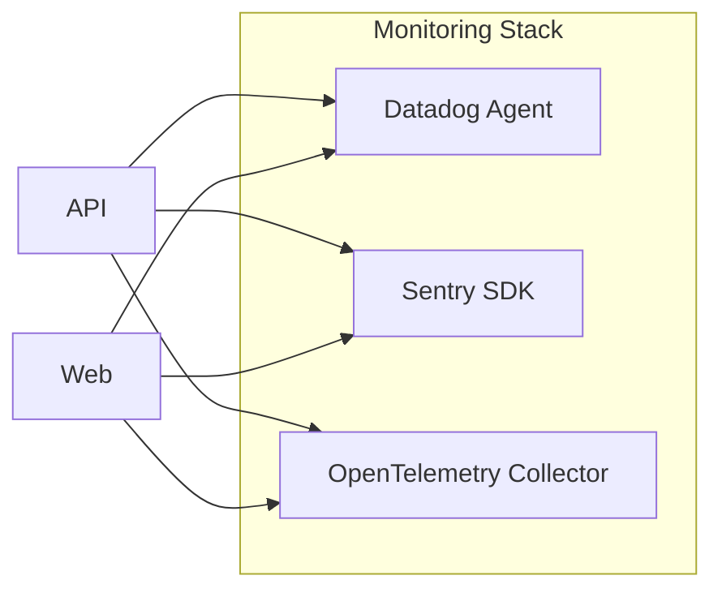

<!-- 
  B2B Sales Intelligence Platform - Comprehensive Architecture Documentation
  ----------------------------------------------------------------------------
  File: infrastructure/docs/architecture.md
  Version: 1.0.0
  Architecture Type: Serverless Microservices
  Environments: development, staging, production
  Security Compliance: SOC2, GDPR, CCPA

  External / Third-Party Libraries (IE2):
    - mermaid-js@9.x for architecture diagrams
    - markdown@1.x for documentation formatting

  Internal Imports (IE1):
    - monitoring_docs (from monitoring.md), referencing:
      * monitoring_stack
      * alert_configurations
    - terraform_config (from ../terraform/main.tf), referencing:
      * infrastructure_outputs
      * scaling_configurations

  Requirements Addressed (per JSON specification):
    1. System Architecture (2. SYSTEM ARCHITECTURE / 2.1 High-Level Architecture)
    2. Component Architecture (2.2 Component Details / Core Components)
    3. Technical Decisions (2.3 Technical Decisions / Architecture Choices)
    4. Security Architecture (7. SECURITY CONSIDERATIONS / 7.1 Authentication and Authorization)
    5. Deployment Architecture (8. INFRASTRUCTURE / 8.1 Deployment Environment)

  This markdown file provides an enterprise-level, production-ready architecture 
  document. It integrates references to Terraform-based infrastructure outputs, 
  monitoring stack configurations, and enumerates all essential decisions 
  regarding design, security, and scaling strategies.

  ----------------------------------------------------------------------------
-->

# B2B Sales Intelligence Platform - Architecture Documentation

This document details the comprehensive system architecture for the B2B Sales Intelligence Platform, aligning with the project’s technical specification. It incorporates high-level design, component details, technical decisions, security considerations, and deployment architecture. It also references, where relevant, internal modules such as "monitoring_docs" for the monitoring stack and "terraform_config" for infrastructure outputs and scaling parameters.

---

## 1. Overview

The B2B Sales Intelligence Platform is designed to streamline lead management, automate email campaigns, and offer data-driven insights to sales and marketing teams. Our architecture prioritizes serverless microservices, high scalability, robust security controls (SOC2/GDPR/CCPA), and a global deployment approach across dev, staging, and production environments.

Key Stakeholders:
• Sales Representatives and SDRs  
• Marketing Teams  
• Business Development Professionals  

Goals:
• Reduce prospecting time by 60% via AI-powered lead sourcing and filtering  
• Increase conversion rates leveraging lead scoring and personalized outreach  
• Provide robust integrations with CRM systems and email providers  
• Maintain enterprise-grade security and compliance  

Core Technologies:
• Next.js (Web Application)  
• Supabase (Database and Auth)  
• Redis (Cache Layer)  
• Resend (Email Service)  
• OpenAI GPT-4 (Lead Enrichment)  
• Stripe (Payments)  
• Vercel (Hosting and Edge Deployment)  

Monitoring & Observability (from “monitoring_docs” reference):
• Datadog integration for metrics and logs  
• Sentry for error alerts and issue tracking  
• OpenTelemetry for distributed tracing  
• Alert rules (alert_configurations) to ensure timely triage  

Infrastructure Outputs & Scaling (from “terraform_config” reference):
• Production-ready multi-environment database, cache, and storage stacks  
• Infrastructure outputs (infrastructure_outputs) including DB connection info  
• Potential vertical and horizontal scaling configurations (scaling_configurations)  

---

## 2. System Architecture

### 2.1 High-Level Architecture

The architecture follows a serverless microservices pattern, deploying major components on Vercel (for the Next.js application) and Supabase (for PostgreSQL and Auth). Redis Enterprise provides in-memory caching, while external APIs (OpenAI, Stripe, Resend) complete the operational ecosystem.

Below is a Mermaid diagram illustrating the primary interactions within the platform:

```mermaid
%% Using mermaid-js@9.x
flowchart LR

    subgraph External Services
        A[OpenAI GPT-4] -- AI-based Enrichment -->
        B[Resend Email Service] -- Email Delivery -->
        C[Stripe Payment Gateway] -- Billing -->
    end

    subgraph B2B Platform
        Web[Next.js Web Layer] --> API[Next.js API Routes]
        API --> SupabaseDB[Supabase PostgreSQL]
        API --> RedisCache[Redis Enterprise]
        API -- Auth --> SupabaseAuth[Supabase Auth]
    end

    Web -- HTTP/HTTPS --> API
    API -- "Lead Data & Campaigns" --> SupabaseDB
    API -- "Session & Caching" --> RedisCache
    API -- "User Authentication" --> SupabaseAuth
    API --> A
    API --> B
    API --> C
```

Highlights:
• A monolithic Next.js codebase with distinct API routes communicating with the data and cache layers  
• Supabase manages relational data storage, user identities, and real-time subscriptions  
• Redis handles caching, job queue data, and partial ephemeral states  
• External integrations for AI-based lead enrichment, email dispatch, and payment processes  

---

### 2.2 Component Architecture

Detailed view of each system component and how modular boundaries are maintained.

• Web Application (Next.js):  
  - Implements SSR and client-side rendering for the UI  
  - Integrates React-based pages, providing a fluid user experience  
  - Leverages Next.js 14+ features for improved routing and edge capabilities  

• API Layer (Next.js API Routes):  
  - Serverless functions implementing the platform’s business logic  
  - Interacts with PostgreSQL via Prisma or direct SQL (Supabase client)  
  - Handles external service calls (OpenAI, Resend, Stripe)  
  - Applies Zod for schema validation on incoming requests  

• Supabase (Database + Auth):  
  - PostgreSQL for structured data (leads, campaigns, user info)  
  - Supabase Auth for JWT-based session handling and role-based authorization  
  - Real-time notifications for updates to leads, campaigns, or analytics  

• Redis Cache:  
  - In-memory store to reduce read-write load on the database  
  - Bull or similar job queue can be layered to handle background tasks (e.g., large data imports)  
  - High Availability with cluster_mode and multiple nodes  

• Frontend + Backend Integration (IE1 usage example):  
  - The platform imports environment-specific or global references from “terraform_config” outputs for the DB/Cache endpoints  
  - Also references “monitoring_docs” for hooking into Datadog or Sentry  

• Monitoring Stack (from “monitoring_docs”):  
  - Collected metrics: response times, CPU usage, memory usage, lead conversions  
  - Alert configurations: error_rate_alerts, performance_alerts, security_alerts (alert_configurations)  
  - Sentry for immediate error-boundary instrumentation and security alerts  

---

### 2.3 Technical Decisions

Key architectural considerations:

1. Monolithic Codebase with Serverless Deployment  
   - Rationale: Simplifies dev & deployment while still scaling effectively on Vercel’s infrastructure  

2. PostgreSQL + Redis for Data and Caching  
   - Rationale: Balance strong relational consistency with high-speed ephemeral reads  
   - Summarized in “infrastructure_outputs” from Terraform main config  

3. Supabase for Authentication and Real-time Subscriptions  
   - Rationale: Minimally invasive auth model; real-time leads/campaign updates  

4. Horizontal Scaling for the Web Layer via Vercel  
   - Rationale: Auto-scale at the Edge for global response and SSR performance  
   - Part of “scaling_configurations” in the Terraform config  

5. Security Emphasis (SOC2, GDPR, CCPA)  
   - Achieved via data encryption, minimal data exposure, robust role-based access  

6. Integration Patterns  
   - RESTful calls for external services (OpenAI, Stripe, Resend)  
   - Webhooks for inbound notifications (e.g., email events, payment events)  
   - GraphQL could be added if advanced client queries are needed  

---

## 3. Security Architecture

### 3.1 Authentication & Authorization

• Supabase Auth:  
  - JWT tokens for client interactions  
  - Role-based access control (RBAC) layered on top for restricted endpoints  
  - MFA possible for administrative or manager-level roles  

• OAuth 2.0 / Social Login Support:  
  - Extensible to Google, LinkedIn for frictionless user onboarding  
  - Mapped to internal roles post-auth  

• API Keys:  
  - Used for programmatic or third-party integrations  
  - Restrictive scopes ensuring minimal privileges  

• Zero-Trust Approach:  
  - All requests validated with Zod or schema-based checks  
  - Rates and usage monitored via Redis-based throttling  

### 3.2 Data Security & Compliance

• At-Rest Encryption:  
  - Supabase-managed Postgres encryption  
  - Redis Enterprise with TLS certificates for in-transit encryption  

• Backups & Archival:  
  - Automated daily backups (minimum of 7 days retention)  
  - Optional read replicas for high availability  

• Compliance:  
  - SOC2 policies for data access, logging, and monitoring  
  - GDPR/CCPA compliance respecting data subject rights, secure data destruction  

• Sentry Security Alerts (reference to “security_alerts” from alert_configurations):  
  - Authentication failure alerting  
  - Immediate on-call escalation for suspicious activity  

---

## 4. Deployment Architecture

### 4.1 Environments & Workflow

The platform is deployed in three main environments (development, staging, production). Each environment is described in “DEPLOYMENT_ENVIRONMENTS” from the global config. Key attributes:

• Development  
  - Preview deployments on Vercel  
  - Reduced or disabled monitoring  

• Staging  
  - Mirrors production with full monitoring  
  - Final QA gate for new features and final performance tests  

• Production  
  - Edge-deployed Next.js with auto-scaling  
  - Production-grade Supabase, Redis cluster, and advanced security  

### 4.2 Terraform-Based Infrastructure Provisioning

Our Terraform main configuration (../terraform/main.tf) defines:

• Supabase PostgreSQL & Auth (module.database)  
  - Configurable read replicas, backup retention days, encryption toggles  
  - Outputs “database_url” and “read_replica_urls” as part of “infrastructure_outputs”  

• Redis Enterprise Cluster (module.cache)  
  - node_count > 1 for redundancy or cluster_mode  
  - Automatic failover and scheduled backups  
  - Exposes “redis_endpoint” in “infrastructure_outputs”  

• S3 + CloudFront (module.storage)  
  - Bucket for attachments or user uploads  
  - Optional CDN distribution for optimized file delivery  

• Infrastructure Outputs (IE3 generosity):  
  - “database_url”  
  - “read_replica_urls”  
  - “redis_endpoint”  
  - “backup_configurations”  
  - “monitoring_endpoints”  

All major resources are tagged with project_name/environment for consistent asset management.

### 4.3 Scaling Strategies

(Referencing “scaling_configurations” from main Terraform or conceptual expansions)

• Horizontal Scaling  
  - Vercel automatically spins new instances on traffic spikes  
  - Worker concurrency for background tasks using queue + Redis  

• Vertical Scaling  
  - Supabase tier upgrades  
  - Redis cluster node sizing adjustments  

• Global Replication  
  - Optionally replicate DB or object storage across regions for low latency  

---

## 5. Monitoring & Observability

Monitoring is implemented via the “monitoring_docs” import (monitoring_stack), combining:

• Datadog (metrics, logs)  
  - API & Web dashboards for real-time performance  
  - CPU, memory, error rate, lead conversion metrics  

• Sentry (errors, issues, security events)  
  - alert_configurations define high/critical thresholds:  
    - error_rate_alerts > 5% triggers pagerduty  
    - performance_alerts if response times exceed 500ms  
    - security_alerts for auth failures or suspicious patterns  

• OpenTelemetry (tracing)  
  - End-to-end transaction visibility across Next.js routes and external APIs  

Mermaid example referencing the “monitoring_stack”:



---

## 6. Summary of Key Outputs & Configuration

Following the “terraform_config” (../terraform/main.tf) reference, the “infrastructure_outputs” object consolidates:

• database_url: Primary Postgres connection string  
• read_replica_urls: Array of read-only replica endpoints  
• redis_endpoint: Main Redis cluster endpoint  
• cache_rules: Alert thresholds on memory or CPU usage  
• backup_configurations: Info on backup schedules & retention  
• monitoring_endpoints: References for DB and Redis metrics  

These outputs facilitate environment-agnostic deployment, letting the Next.js serverless functions or other ecosystem services automatically pull environment credentials and scaling data.

---

## 7. Conclusion

This architecture documentation encompasses:

• High-Level & Detailed System Architecture (Section 2)  
• Component Architecture & Technical Decisions (Sections 2.2, 2.3)  
• Security Architecture with authentication, authorization, compliance coverage (Section 3)  
• Deployment Architecture across multiple environments, referencing Terraform modules (Section 4)  
• Monitoring & Observability integrally tied to Datadog, Sentry, and OpenTelemetry (Section 5)  
• Centralized Infrastructure Outputs guiding environment configuration (Section 6)  

By merging serverless microservices, robust caching, data encryption at rest, and an advanced observability framework, the B2B Sales Intelligence Platform delivers a scalable, secure, and globally distributed solution meeting modern enterprise requirements.