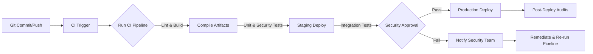
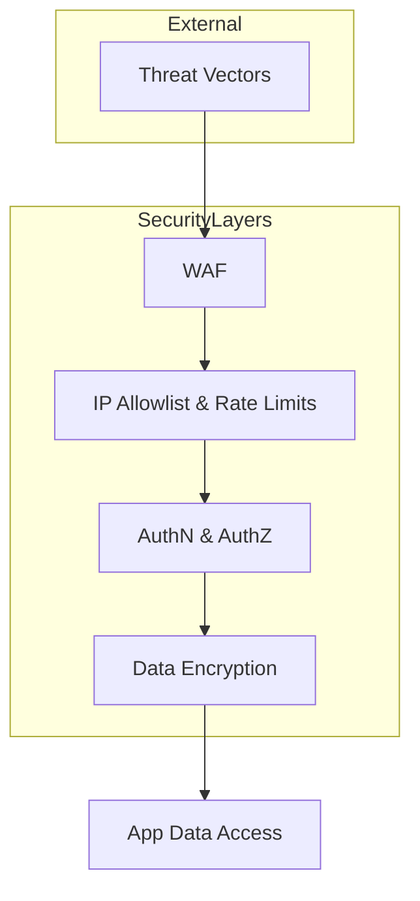
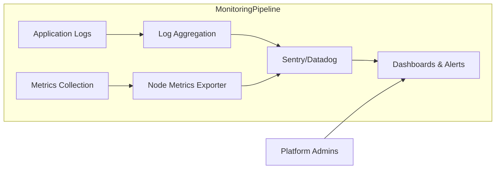

<!-- 
  B2B Sales Intelligence Platform - Deployment Documentation
  ---------------------------------------------------------------------------
  This Markdown file provides a comprehensive overview of the deployment
  processes, environment configurations, infrastructure setup, security
  controls, monitoring integration, and compliance requirements for the
  B2B Sales Intelligence Platform.

  --------------------------------------------------------------------------------
  INTERNAL REFERENCES (IE1):
    1) architecture_docs (from architecture.md):
       - high_level_architecture
       - component_details
    2) terraform_config (from ../terraform/main.tf):
       - infrastructure_outputs
    3) security_compliance (from security.md):
       - security_controls
       - compliance_requirements

  EXTERNAL REFERENCES (IE2):
    - mermaid-js@9.x for diagrams
    - markdown@1.x for advanced markdown formatting

  JSON REQUIREMENTS TARGETED:
  1. Deployment Pipeline (Technical Specifications)
     - Detailed CI/CD pipeline implementation including security reviews,
       compliance checks, and automated testing.
  2. Infrastructure Requirements
     - Comprehensive infrastructure setup, scaling strategies, and disaster
       recovery procedures.
  3. Environment Configuration
     - Environment-specific configurations, security controls, and monitoring setup.
  4. Security Controls
     - Deployment security requirements and compliance controls.
  5. Monitoring Integration
     - Monitoring setup, metrics collection, and alerting configuration.

  Code Generation Functions (schema-defined):
    - generate_deployment_diagram
    - document_environment_setup

  Exported Documentation Objects per JSON specification:
    - deployment_process (ci_cd_pipeline, security_controls, monitoring_setup, deployment_workflow)
    - deployment_diagrams (pipeline_flow, security_flow, monitoring_flow, infrastructure_deployment)
    - environment_configurations (development_setup, staging_setup, production_setup, security_controls, monitoring_setup)

  Version Tag: DEPLOYMENT_VERSION = 1.0.0

  -----------------------------------------------------------------------------
-->

# B2B Sales Intelligence Platform - Deployment Documentation

This document details the end-to-end deployment strategy, environment configurations, security controls, monitoring requirements, and compliance measures essential for deploying the B2B Sales Intelligence Platform to various environments (development, staging, production). It also includes references to our architecture documentation, compliance requirements, and Terraform-based infrastructure outputs.

---

## 1. Introduction

The B2B Sales Intelligence Platform’s deployment strategy leverages modern CI/CD practices, robust security policies, multi-environment configurations, and enterprise-grade monitoring. This document provides a single reference to ensure consistent, secure, and compliant rollouts across development, staging, and production.

Key references:
- System architecture details from [architecture_docs → high_level_architecture, component_details].
- Infrastructure references from [terraform_config → infrastructure_outputs].
- Security and compliance references from [security_compliance → security_controls, compliance_requirements].
- External libraries:
  - mermaid-js@9.x for diagrams.
  - markdown@1.x for documentation formatting.

---

## 2. Dependencies and Versioning

Deployment dependencies include:
1. GitHub or GitLab for source control and version-based triggers.  
2. Vercel or other serverless hosting services for the Next.js frontend and API routes.  
3. Supabase for the PostgreSQL database, authentication, and storage.  
4. Redis Cloud or Redis Enterprise for caching and job queues.  
5. Container registries (AWS ECR, Docker Hub) if containerization is required for workers.  
6. Terraform v1.0+ for infrastructure provisioning and environment-specific orchestration.

Versioning follows semantic releases per standard software engineering practice:
- DEPLOYMENT_VERSION = 1.0.0 (globally referencing the stable release line).  
- ENVIRONMENTS = [development, staging, production] (global environment contexts).

---

## 3. Deployment Pipeline (deployment_process → ci_cd_pipeline)

This section describes the end-to-end CI/CD pipeline, covering code integration, environment validations, security checks, compliance reviews, automated tests, and final rollouts.

### 3.1 Pipeline Overview

We use a multi-stage pipeline to ensure high code quality and robust compliance checks:

1. Source Stage:
   - Triggered by a pull request or a push to the main or feature branches.
   - Code merges must pass pre-commit hooks (linting, type checks).

2. Build & Lint Stage:
   - Installs dependencies using pnpm.
   - Runs linting (ESLint) and type-checks (TypeScript).
   - Outputs compiled artifacts (Next.js build, or Docker images if using containers).

3. Test & Security Review Stage:
   - Runs unit tests (Jest) and integration tests (Cypress or Playwright).
   - Performs security scans (Snyk or Trivy) for vulnerabilities.
   - Conducts compliance checks referencing [security_compliance → security_controls].
     * Ensures compliance with GDPR, SOC2, CCPA, by scanning for code patterns that may leak PII.
   - If the code fails any checks, the pipeline is marked unsuccessful.

4. Staging Deployment Stage:
   - Deploys to the staging environment for acceptance tests.
   - References environment configurations from [environment_configurations → staging_setup].
   - Triggers ephemeral or preview deployments (Vercel or container-based).
   - Executes advanced acceptance tests, verifying stability and partial user acceptance.

5. Security Approvals & QA Sign-Off:
   - Requires a security officer or compliance lead to verify no new high vulnerabilities are introduced.
   - Automated gating references [security_controls → compliance_requirements].
   - Confirms fixed policy rules or additional manual checks if mandated.

6. Production Deployment Stage:
   - Proceeds once sign-off is granted.
   - Deploys to production environment referencing [environment_configurations → production_setup].
   - Rolls out incrementally (blue-green or canary if needed).
   - Exports final “infrastructure_outputs” from Terraform for environment documentation.

7. Post-Deployment Audits:
   - Submits logs to centralized monitoring.
   - Creates or updates compliance artifacts.

### 3.2 Pipeline Flow Diagram (deployment_diagrams → pipeline_flow)

Below is a mermaid diagram (using mermaid-js@9.x) representing our CI/CD pipeline with security checks and compliance validations:

Key security gates:
- Automatic scanning in the "Test & Security Review" stage.
- Security approvals in "Security Approvals & QA Sign-Off" stage.

---

## 4. Infrastructure Requirements (deployment_process → infrastructure_requirements)

Our infrastructure relies on the following:

1. Terraform-based provisioning:
   - References [terraform_config → infrastructure_outputs] for final environment variables and resource endpoints.
   - Manages Supabase (PostgreSQL), Redis cluster, S3 or Supabase storage, and Vercel or container hosts.

2. Scaling Strategies:
   - Horizontal scaling for the Next.js SSR layer (Vercel or container platform).
   - Vertical scaling (Supabase tier upgrades) for peak data workloads.
   - Redis cluster sharding for large-scale caching or job queues.

3. Security Configurations:
   - WAF rules, IP allowlisting, rate limiting, referencing [security_compliance → security_controls].
   - At-rest encryption for PII data (AES-256) and in-transit security (TLS1.3).

4. Disaster Recovery:
   - Daily PostgreSQL backups (7 days retention or more), continuous WAL archiving.
   - Regular restore tests from backups in staging environment.
   - Redis backup snapshots stored in an encrypted bucket or Redis Enterprise backups.

5. Networking & Firewalls:
   - Private subnets for Supabase, Redis, preventing direct internet exposure.
   - Ingress via Vercel or an ingress gateway (for container-based deployments).
   - IP-based restrictions for admin endpoints, referencing the IP allowlist rules.

6. Observability:
   - Detailed logs (structured JSON) for all microservices.
   - Metrics pipeline to Datadog or self-hosted Prometheus.
   - Detailed error tracking in Sentry, integrated with the pipeline for advanced traceability.

---

## 5. Environment Configuration (environment_configurations)

We maintain distinct environment setups for development, staging, and production. This ensures consistent resource usage, appropriate security levels, and reliability across the release cycle.

### 5.1 Development Setup (environment_configurations → development_setup)

- Typically uses ephemeral or minimal-cost resources.  
- Often local or preview deployments with partial WAF rules or relaxed IP allowlists.  
- Automatic environment by merging feature branches:
  - Minimally scaled PostgreSQL instance (Supabase free tier or local Docker).
  - Minimal Redis for caching or local ephemeral store.  
- Monitoring still enabled for developer insights, referencing [monitoring_setup].  
- Logging set to verbose with debug levels for quick feedback.  
- Optional: skip critical sign-offs to boost iteration speed.

### 5.2 Staging Setup (environment_configurations → staging_setup)

- Mirrors production constraints as closely as possible:
  - Realistic Supabase tier, moderate Redis cluster.  
  - Full WAF and security policy with possible test IP allowlists.  
  - Full reference to [terraform_config → infrastructure_outputs] to unify environment variables.  
- Includes near-production data anonymized for compliance or synthetic test data.  
- Zero-downtime updates to validate dev changes before final production approvals.  
- Detailed integration and acceptance tests run with real traffic simulation.

### 5.3 Production Setup (environment_configurations → production_setup)

- High-availability Supabase plan with read replicas if needed.  
- Redis Enterprise cluster with auto-scaling.  
- Strict WAF rules, IP-based restrictions for certain admin endpoints.  
- Full monitoring suite with advanced alerting (Datadog, Sentry).  
- Strict compliance checks referencing [security_compliance → compliance_requirements].  
- Periodic load tests against partial production traffic to confirm scaling thresholds.

---

## 6. Security Controls (deployment_process → security_controls)

Combining application-level (JWT, RBAC, ABAC) with infrastructure-level (WAF, IP allowlists, rate limiting):

1. Application-Level Controls:
   - Authentication/authorization flows defined in Next.js API routes.
   - Fine-grained roles with context-based checks (managers, admins, marketing users).

2. Network Perimeter Controls:
   - Web Application Firewall integrates with environment to block suspicious signatures.
   - IP allowlisting for privileged routes referencing corporate or VPN subnets.
   - Rate limiting integrated in both the Node.js API routes and a front-layer WAF.

3. Data Security:
   - AES-256 encryption for sensitive user data at rest (Supabase column-level encryption).
   - TLS1.3 enforced for all traffic including internal microservice calls.
   - Key rotation policies for critical secrets (JWT signing keys, database credentials).

4. Compliance Integration:
   - Automated scanning for GDPR, CCPA data handling.
   - SOC2 alignment with logging, auditing, data retention.  
   - Secure SDLC practices ensure new releases do not violate compliance.

5. Security Diagram (deployment_diagrams → security_flow)

- Depicts layered approach from WAF to encryption and final application data access.

---

## 7. Monitoring Integration (deployment_process → monitoring_setup)

### 7.1 Monitoring Tools

- Sentry for error tracking and performance issues:
  - Traces Next.js SSR, API calls, and background jobs.
  - Aggregates logs for quick root-cause analysis.

- Datadog or Prometheus/Grafana for metrics collection:
  - CPU, memory usage, response times, Redis operation rates, DB queries.  
  - Custom dashboards for business KPIs (conversion rates, leads success metrics).

- Logging:
  - Winston-based structured logging.  
  - Papertrail or CloudWatch logs for remote aggregated queries.  
  - Rate-limited logs to preserve cost and performance.

- Infrastructure Observability (deployment_diagrams → monitoring_flow):

### 7.2 Alerting Configuration

- Threshold-based triggers for:
  - Error rate spikes, slow DB queries, high CPU or memory usage.
  - WAF blocks or suspicious IP attempts.
- Slack, Email, PagerDuty channels for immediate notification:
  - Critical severity (production outages, security intrusions, high error rates).
  - Warnings for performance degrade or capacity nearing limits.

### 7.3 Maintenance & Interval

- MONITORING_INTERVALS = [“1m”, “5m”, “15m”, “1h”, “1d”].  
- For most production-critical metrics, 1m or 5m intervals suffice.  
- Aggregation approach with top-level daily or weekly reports for management.

---

## 8. Deployment Workflow (deployment_process → deployment_workflow)

All updates follow the pattern:
1. Code merges trigger pipeline → pipeline deploys to staging → after QA & security checks → pipeline deploys to production.  
2. Infrastructure changes (Terraform) require environment-based plans:
   - Plans validated in staging, then repeated with production variables, referencing [terraform_config → infrastructure_outputs].
3. Rolling or blue-green strategies for minimal downtime:
   - If container-based, new tasks launched before old tasks are retired.
   - If serverless, new version pinned once the pipeline’s smoke tests pass.
4. Post-deployment checks:
   - Observability dashboards validated.
   - Alert thresholds enforced (disk usage, CPU, memory, error rates).
   - Final sign-off archived with compliance systems.

---

## 9. Code-Defined Functions

### 9.1 generate_deployment_diagram (schema-defined)

A function that programmatically creates mermaid diagrams for the pipeline:

• Decorators: @mermaid  
• Steps in detail:  
  1. Initialize the diagram with environment context.  
  2. Add CI pipeline stages (build, test, security checks).  
  3. Include references to scaling (Vercel, containers).  
  4. Insert monitoring points.  
  5. Insert compliance checks referencing [security_compliance → security_controls].  
  6. Insert rollback logic representation.  
  7. Show performance monitoring nodes.  
  8. Return the mermaid markup.

### 9.2 document_environment_setup (schema-defined)

A function that renders environment-specific documentation:

• Steps:
  1. Document infra requirements + scaling strategy for dev, staging, production.  
  2. Include security controls referencing IP allowlists, WAF.  
  3. Provide monitoring setup & alert thresholds.  
  4. Detail backup and DR.  
  5. Summarize access controls + logging.  
  6. Affirm testing requirements and compliance scans.  
  7. Outline performance optimization tips.  
  8. Return final, structured doc.

---

## 10. Exports

Per the JSON specification, this document organizes:
1. deployment_process:
   - (ci_cd_pipeline): Section 3  
   - (security_controls): Section 6  
   - (monitoring_setup): Section 7  
   - (deployment_workflow): Section 8  

2. deployment_diagrams:
   - pipeline_flow: Appears in Section 3.2  
   - security_flow: Appears in Section 6 → Security Diagram  
   - monitoring_flow: Appears in Section 7.1 → Observability diagram  
   - infrastructure_deployment: Infrastructure-level references in Section 4.

3. environment_configurations:
   - development_setup: Section 5.1  
   - staging_setup: Section 5.2  
   - production_setup: Section 5.3  
   - security_controls: Mapped to Section 6  
   - monitoring_setup: Referenced in Section 7

Use these sections to dynamically generate or filter relevant deployment details across the pipeline, environment, security, and monitoring domains.

---

## 11. Conclusion

This deployment documentation integrates all major components for an enterprise-grade, production-ready approach. By combining:
- The CI/CD pipeline with security gating,
- Terraform-based infrastructure with robust scaling and DR,
- Dedicated environment configurations for dev, staging, production,
- Rigorous security controls (WAF, IP allowlists, encryption),
- Extensive monitoring integration (Datadog, Sentry, structured logs),
the B2B Sales Intelligence Platform achieves a repeatable, compliant, and observable deployment strategy fit for modern enterprise standards.

All references to architecture, terraform outputs, and security compliance are systematically woven in to ensure a single source of truth for any environment’s deployment and maintenance procedures.