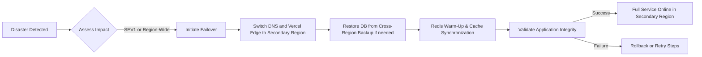
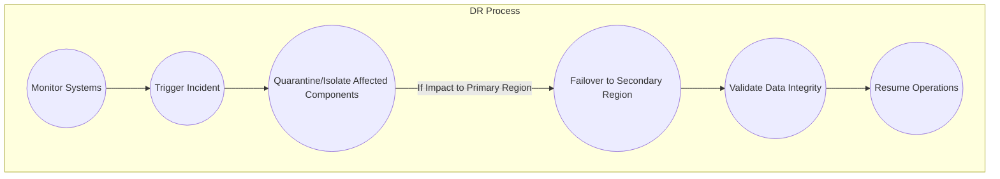

<!--
  B2B SALES INTELLIGENCE PLATFORM - DISASTER RECOVERY DOCUMENTATION
  -----------------------------------------------------------------
  File: disaster-recovery.md
  Purpose:
    Delivers comprehensive guidance on disaster recovery (DR) procedures,
    backup strategies, failover mechanisms, and business continuity plans
    for the B2B Sales Intelligence Platform.
    
  References & Imports:
    1) architecture_docs (from architecture.md):
       - high_level_architecture
       - deployment_architecture
       Provides system context for DR planning and multi-region deployment.
    2) monitoring_docs (from monitoring.md):
       - incident_response
       - monitoring_stack
       Aids in integrating incident response and alerting with DR protocols.
    3) terraform_config (from ../terraform/main.tf):
       - infrastructure_outputs
       - failover_config
       Exposes infrastructure configuration, failover settings, and environment-specific outputs.

  Globals:
    - RPO (Recovery Point Objective): 1 hour
    - RTO (Recovery Time Objective): 4 hours
    - BACKUP_RETENTION: 30 days
    - COMPLIANCE_STANDARDS: SOC 2, GDPR, CCPA
    - ENCRYPTION_STANDARD: AES-256-GCM

  Requirements Addressed:
    - Data Security (7.2 DATA SECURITY/Backup and Recovery)
      Implement a comprehensive backup strategy with cross-region replication,
      encryption, and verification for 1-hour RPO.
    - Infrastructure Requirements (4.5 DEVELOPMENT & DEPLOYMENT/Infrastructure Requirements)
      Define multi-region redundancy, automated failover, and zero-downtime deployment.
    - High Availability (2.1 High-Level Architecture)
      Ensure 99.99% availability with redundant components, automated health checks, and failover.

  Exports:
    Exporting "disaster_recovery_plan" with sections:
      - backup_procedures
      - recovery_procedures
      - compliance_procedures
    Exporting "business_continuity_plan" with sections:
      - communication_matrix
      - escalation_procedures
      - recovery_team_responsibilities
-->

# Disaster Recovery & Business Continuity

This document provides an enterprise-grade blueprint for recovering from disasters while maintaining key business operations. It covers backup and restoration workflows, system redundancy, and compliance-driven processes ensuring minimal downtime and data loss.

---

## 1. Introduction

Disaster events can include data center outages, network disruptions, or security breaches. This plan ensures:

• 99.99% uptime, aligning with High Availability requirements referenced in [architecture_docs → high_level_architecture].  
• A 1-hour RPO (Recovery Point Objective) to limit data loss, achieved via frequent backups and cross-region replication.  
• A 4-hour RTO (Recovery Time Objective) to restore full functionality, leveraging automated failover.  
• Adherence to SOC 2, GDPR, and CCPA compliance, specifically for data handling and breach notifications.

The B2B Sales Intelligence Platform’s DR framework references:
• [terraform_config → infrastructure_outputs], consolidating environment endpoints for multi-region coverage.  
• [terraform_config → failover_config], dictating automated failover triggers and cutover steps.  
• [monitoring_docs → incident_response], for standardized severity classifications and escalations.  

---

## 2. DR Architecture and Failover

### 2.1 Multi-Region Strategy

Our multi-region design, per [architecture_docs → high_level_architecture], duplicates core services (Next.js app, Supabase DB, Redis cluster, file storage) in geographically disparate locations:

1. Primary Region (active environment).  
2. Secondary Region (hot standby).  

Real-time replication ensures that if the Primary Region fails, the Secondary Region activates. Key pillars:

• Automated Health Checks: Each component uses heartbeat metrics and [monitoring_docs → monitoring_stack] hooks.  
• Intelligent Failover: [terraform_config → failover_config] triggers Vercel and Supabase to redirect traffic.  
• Zero-Downtime Deployment: Rolling updates across regions avoid disruptions.

### 2.2 System Components Redundancy

• PostgreSQL (Supabase): Multi-zone and cross-region read replica, with continuous WAL archiving.  
• Redis Enterprise: Cluster-mode with 3+ nodes; daily backups stored in a different region.  
• Storage (S3-compatible): Cross-region replication configured; versioning ensures 30 days of historical object retention.  
• Application Layer: Deployed across multiple Vercel edge locations, auto-scaling to keep 99.99% availability.  

---

## 3. disaster_recovery_plan.backup_procedures

### 3.1 Overview of Backup Strategy

This platform incorporates a consistent backup framework and encryption (AES-256-GCM) for data at rest and in transit. RPO is 1 hour thanks to frequent snapshots and near-real-time replication. The approach is shaped by [terraform_config → infrastructure_outputs.backup_configurations] which unify:

• Database backups (Supabase DB)  
• Redis snapshot backups  
• Cross-region S3 versioning  

### 3.2 Procedure Documented via "document_backup_procedures"

We employ an internal function, “document_backup_procedures(component_type, compliance_requirements),” to generate standardized policies. Key steps:

1. Document Automated Scheduling: Hourly snapshots for DB and Redis, daily for full S3 bucket snapshots.  
2. Detail Encryption Requirements: Each snapshot is encrypted with AES-256-GCM at rest.  
3. Cross-Region Replication: S3-based artifacts replicate to a secondary region for DR.  
4. Automated Verification: Every 24 hours, sample backups are restored in a sandbox to validate data integrity.  
5. Compliance Validation: Ensures the backups conform to SOC 2, GDPR, and CCPA guidelines.  
6. Retention Policies: The platform enforces a 30-day retention window.  
7. Restoration Testing: Periodic DR drills measure RTO compliance (4 hours).  
8. Health Check Procedures: Monitoring and alerts run each step to confirm success.

### 3.3 Database Backup Details

• Supabase Backups: Using transaction log shipping and daily full snapshots retained 30 days.  
• PITR (Point-In-Time Recovery): Enabled for production. On detection of corruption, revert to the last known good WAL record.  
• Automated Copy to Secondary Region: Leveraging cloud-based asynchronous streaming.

### 3.4 Redis Backup Details

• Snapshot-based backups daily; incremental every 6 hours.  
• Retained in cross-region storage for 30 days.  
• Restoration test monthly, verifying ephemeral data can be rebuilt swiftly.

### 3.5 File Storage Backup

• S3 Versioning + Cross-Region Replication.  
• Lifecycle rules transition older versions to cheaper storage after 14 days, but keep them for 30.  
• Each version is encrypted (AES-256-GCM).  
• Map to [terraform_config → infrastructure_outputs.backup_configurations] for schedules.

---

## 4. disaster_recovery_plan.recovery_procedures

### 4.1 Recovery Workflow

Upon major incident or regional failure, the “generate_dr_process_diagram(process_type, process_config)” function provides a detailed flow:

Key steps:

• Automated Health Checks: On continuous failures, triggers incident response.  
• Failover Execution: [terraform_config → failover_config] modifies environment routes and database endpoints.  
• Data Validation: Ensure that recovered data meets RPO of 1 hour.  
• Service Reverification: Confirm app, DB, and Redis are consistent.  
• Communication: Activate pre-defined channels in [business_continuity_plan.communication_matrix].

### 4.2 RTO Procedures

To satisfy the 4-hour RTO:

• Infrastructure as Code Rebuild: Vercel deployments and Supabase environment re-provision in ~30 min.  
• Database Restoration: Rolling load of WAL segments plus snapshot, typically <1 hour.  
• DNS Propagation: TTL set to minimal (e.g., 60s) to expedite switch.  
• Verification & Smoke Tests: Automatic run of synthetic transactions confirms system readiness.

### 4.3 Rollback Approach

If failover or partial restore fails:

1. Revert environment changes.  
2. Re-initiate from a known valid snapshot.  
3. Reattempt data synchronization.  
4. Escalate to senior engineering management and execute manual DR steps if automated checks fail repeatedly.

---

## 5. disaster_recovery_plan.compliance_procedures

### 5.1 Security and Regulatory Overview

All DR measures align with:

• SOC 2: Proper logging, controls, and data retention policies.  
• GDPR & CCPA: Right-to-erasure, breach notifications, and data minimization.  
• AES-256-GCM encryption for backups and in-flight replication.

### 5.2 DR Auditing and Documentation

Audits confirm:

• Backup logs, LTR (long-term retention) for 30 days.  
• Restoration logs, ensuring minimal data exposure.  
• Access control logs, verifying only authorized roles triggered DR.

### 5.3 Testing & Reporting

• Quarterly DR Drills: Evaluate failover times, backup validity, compliance checks.  
• Post-Drill Report: Summarizes RTO, data integrity, user impact.  
• Security Team Review: Identity & Access Management scans for each DR test, ensuring no policy violations.

---

## 6. business_continuity_plan.communication_matrix

### 6.1 Stakeholder Communication

| Stakeholder                | Communication Channel    | Responsibility            |
|---------------------------|-------------------------|---------------------------|
| Executive Leadership      | Email, Slack            | Final decisions, escalate |
| Engineering On-Call       | PagerDuty, Slack        | Implement DR steps        |
| Security Team             | Secure Chat, Email      | Validate compliance       |
| Product Managers          | Slack, Email            | Align user messaging      |
| Customer Support          | Ticket System           | Address client concerns   |

### 6.2 Communication Flows

1. Incident Declared → Slack #incident + Email to leads.  
2. Hourly Status Updates → Slack #incident, logged in post-mortem doc.  
3. Resolution Notice → All-staff email summarizing root cause, timeline, next steps.

---

## 7. business_continuity_plan.escalation_procedures

### 7.1 Incident Severity & Escalation

We integrate [monitoring_docs → incident_response] severity guidelines:

• SEV1: Total platform outage or compromised data → immediate on-call + leadership.  
• SEV2: Partial loss of functionality → on-call within 30 min.  
• SEV3: Minor performance degradation → standard backlog or next business day.

### 7.2 On-Call Roster

• Weeklong rotations for engineering, sysadmin, and security.  
• PagerDuty auto-escalation if no response in 15 minutes.  
• Additional escalation to departmental heads if no acknowledgement after 30 minutes.

### 7.3 Communication Templates

• Initial Alert: "Incident declared at <timestamp>: 
"  
• Update: "Status update: <progress details>, next update in <time>"  
• Resolution: "Incident resolved: <root cause summary>"  

---

## 8. business_continuity_plan.recovery_team_responsibilities

| Role                      | Responsibility                       | Tools & Permissions                |
|---------------------------|--------------------------------------|------------------------------------|
| DR Lead                   | Oversees entire DR process           | Full infra access, Slack, Email    |
| DB Specialist             | Validates DB backups & replication   | Supabase console, DB credentials   |
| Infra Engineer            | Manages infra failover & scaling     | Terraform, Vercel, Cloud console   |
| Security Analyst          | Monitors compliance, logs, forensics | Sentry, SIEM, encryption keys      |
| Communications Manager    | Handles internal & external updates  | Slack, email marketing system      |

---

## 9. Implementation References

1. **Architecture**: See [architecture_docs → deployment_architecture] for multi-region setup impacting DR.  
2. **Monitoring**: See [monitoring_docs → monitoring_stack] for health checks, alerts, logging.  
3. **Infrastructure**: See [terraform_config → infrastructure_outputs] for unified references to DB/Redis endpoints, replication config, and backups. Also [terraform_config → failover_config] for automated region failover.

---

## 10. DR Diagrams (Sample)

Below is a generic mermaid diagram illustrating the DR end-to-end process referencing “generate_dr_process_diagram” steps:

---

## 11. Conclusion

The B2B Sales Intelligence Platform’s disaster recovery and business continuity strategies ensure data protection, swift failover, and minimal disruption. With a 1-hour RPO, rigorous cross-region replication, multi-tier backups, and 4-hour RTO, the platform consistently aligns with industry-standard compliance regimes (SOC 2, GDPR, CCPA). Ongoing drills, robust monitoring, and clearly documented escalation steps empower the organization to maintain high confidence in its operational resilience.

<!-- End of File -->